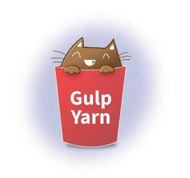
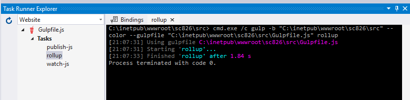

> **This post is part of a series**
> 1. [A quick-start guide to using Node to bundle JavaScript modules for Sitecore](/module-bundling-rollup/)
> 2. **A guide to automating Sitecore development tasks with Gulp**

[[snippet]]
| This tutorial is aimed at Sitecore/.NET developers who are new to the node universe. In the [previous post](/module-bundling-rollup/) we set up a Sitecore project with 2 renderings that utilized ES6 JavaScript modules. We compiled and bundled the JavaScript modules and their 3rd party dependencies using npm and rollup. Today we will improve our setup by adding automation. We will utilize the following frameworks:
| * [Yarn](https://yarnpkg.com/)
| * [Gulp](https://gulpjs.com/)

The files created in this demo can be cloned from [https://github.com/anastasiya29/gulp-yarn-demo](https://github.com/anastasiya29/gulp-yarn-demo)



## Why yarn?
Yarn is a package/dependency manager, and it is a replacement to using npm. Think of it like NuGet for your JavaScript, except that it's waaay faster. (How fast? Crazy fast. "Yarn parallelizes operations to maximize resource utilization so install times are faster than ever" -yarnpkg.com) Plus their site is covered in cats. What more do you need?

## Why gulp?
Gulp is a task runner build tool. Basically, with gulp you write simple js functions, which define different tasks. Tasks can be something like "compile my fancy shmancy react files to plain old js" or "concatenate and minify all my js files" or "copy my js files from my project directory to my Sitecore directory". Think of it like MSBuild for your JavaScript.

## Let's code!

### Prerequisites
We will re-use the View renderings and JavaScript modules created in the last post. The demo assumes the project is set up in a sibling directory to the Sitecore `/Website` folder. My project directory contains a `src` folder for JavaScript modules, `package.json` for managing node dependencies, and `rollup.config.js` for the bundling configuration. The `node-modules` folder will be auto-generated by running `$ yarn install` and the `dist` folder for the distribution-ready bundle will be auto-generated by our `gulp` task.

``` text
Data/
Website/
gulp-yarn-demo/
   ├── dist/          (generated)
   ├── node_modules/  (generated)
   ├── src/
   │   ├──  main.js
   │   └──  modules/
   │      ├── UserGreeting.js
   │      └── WebsiteVisit.js
   ├── package.json
   └── rollup.config.js
```

### Set up yarn
* Use npm to install yarn globally
``` bash
$ npm install --global yarn
```

* npm and yarn are both package managers, and you can't use both within the same project. If you've already been using npm to manage dependencies in your project, then reset by deleting the entire "node_modules/" folder.

### Install node dependencies
* Ensure that your `package.json` specifies the following dependencies and then run `$ yarn install`
``` json
{
  "name": "gulp-yarn-demo",
  "version": "1.0.0",
  "description": "",
  "scripts": {
    "test": "echo \"Error: no test specified\" && exit 1"
  },
  "author": "",
  "license": "ISC",
  "devDependencies": {
    "del": "^3.0.0",
    "gulp": "^3.9.1",
    "gulp-rename": "^1.2.2",
    "gulp-sourcemaps": "^2.6.3",
    "rollup-plugin-commonjs": "^8.2.6",
    "rollup-plugin-inject": "^2.0.0",
    "rollup-plugin-node-resolve": "^3.0.0",
    "rollup-stream": "^1.24.1",
    "vinyl-buffer": "^1.0.1",
    "vinyl-source-stream": "^2.0.0"
  },
  "dependencies": {
    "jquery": "^3.2.1",
    "js-cookie": "^2.2.0",
    "moment": "^2.20.1"
  }
}
```
This adds a new file (`yarn.lock`) to your file system. Yarn will manage this file. 

The jquery, js-cookie, and moment dependencies are used by our Sitecore components. The rollup-plugin-commonjs, rollup-plugin-inject, and rollup-plugin-node-resolve dependencies are used during rollup compilation. These were covered in the previous post. Lets go over the new dev dependencies that were added
* **gulp** (self-explanatory)
* **gulp-rename**: a gulp plugin for renaming files, used during bundling process
* **gulp-sourcemaps**: a gulp plugin for generates sourcemaps for transpiled or minified code, used during bundling process
* **rollup-stream**: a rollup plugin that makes rollup compatible with gulp. This is necessary since rollup does not natively output a stream which we want to use as a starting point in a gulp task
* **vinyl-buffer** & **vinyl-source-stream**: adapters that allow piping streams with other gulp [vinyl](https://github.com/gulpjs/vinyl)
* **del**: a gulp pluging that deletes files, used during MSBuild's 'Clean' step

### Set up gulp

* Gulp is now installed as a development-time dependency, but we're not quite done. Gulp needs a special file where tasks are defined. Add a file named `gulpfile.js` to your working directory with the following contents.

``` javascript
const gulp         = require('gulp');
const rollup       = require('rollup-stream');
const rollupConfig = require('./rollup.config');
const source       = require('vinyl-source-stream');
const buffer       = require('vinyl-buffer');
const sourcemaps   = require('gulp-sourcemaps');
const rename       = require('gulp-rename');
const del          = require("del");

const paths = {
  distributionJS: './dist',
  sourceJS: './src',
  website: './../Website'
};
const bundleName = 'bundle.js';

gulp.task('rollup', () => {                  // define task named 'rollup'
  return rollup(rollupConfig)                // fire up rollup with existing config file
    .pipe(source(rollupConfig.input))        // pipe in entry-point JS file
    .pipe(buffer())                          // buffer the output because many gulp plugins don't support streams
    .pipe(sourcemaps.init({loadMaps: true})) // fire up sourcemaps
    .pipe(rename(bundleName))                // rename output to 'bundle.js'
    .pipe(sourcemaps.write('.'))             // write the sourcemap for 'bundle.js' to 'bundle.js.map'
    .pipe(gulp.dest(paths.distributionJS));  // spit 'bundle.js' and sourcemap out in the 'dist' folder
});
```

### Use gulp to run rollup
The `rollup.config.js` that we created last time needs minor tweaks to be compatible with gulp's rollup.

Contents of rollup.config.js
``` javascript
const resolve  = require('rollup-plugin-node-resolve');
const commonjs = require('rollup-plugin-commonjs');
const inject   = require('rollup-plugin-inject');

module.exports = {
    input: './src/main.js',
    format: 'iife',
    sourcemap: true,
    plugins: [
        resolve({
            customResolveOptions: {
                module: true,
                moduleDirectory: 'node_modules',
                browser: true,
                jsnext: true
            }
        }),
        commonjs({
            include: 'node_modules/**',
        }),
        inject({
            include: '**/*.js',
            exclude: 'node_modules/**',
            $: 'jquery',
            Cookies: 'js-cookie',
            moment: 'moment'
        })
    ]
};
```

Congratulations, you've created your first gulp task! Run it by running `$ gulp rollup` from command line; verify that this adds a 'dist' directory to your project containing `bundle.js` and `bundle.js.map`. The bundle should contain our custom modules transpiled for browser compatibility, as well their 3rd party dependencies.

### Publish rollup bundle to Sitecore instance
Our JavaScript bundle in being compiled into 'gulp-yarn-demo/dist/', but MainLayout.cshtml is expecting the file in 'Website/js'. Lets create a task to handle this publishing

``` javascript
gulp.task('publish-js', ['rollup'], () => {                 // define task named 'publish-js' that depends on task 'rollup'
  return new Promise(resolve => {                           // returning a promise allows this task to run asynchronously
    let bundle = paths.distributionJS + '/' + bundleName;   //
    gulp.src([ bundle, bundle + '.map' ])                   // grab the bundle and sourcemap files
      .pipe(gulp.dest(paths.website + '/js'))               // and copy them into the Sitecore instance
      .on("finish", resolve);
  });
});
```

### Make gulp watch JavaScript files for changes
Now that we have a task that publishes our bundle to the Sitecore instance, we can utilize one of the most useful features of gulp: the `watch` command. This command monitors files for changes, and runs specified code when changes are detected. For our case, we can make it run the `publish-js` task when changes are detected. This is superior to the typical process of copying JavaScript files into Sitecore as part of a project build step because it avoids an AppPool recycle (and the resulting Sitecore warmup time).

``` javascript
gulp.task('watch-js', ['publish-js'], () => {                 // define task named 'watch-js' that depends on task 'publish-js'
  gulp.watch(paths.sourceJS + '/**/*.js', ['publish-js']);  // watch all JS files in 'src' folder for changes; run 'publish-js' if changes are detected
});
```

Similar watch operations can be implemented for Views and Sass files.

## Run gulp from Visual Studio
Visual Studio versions 2015 and higher ship with a [Task Runner Explorer](https://blogs.msdn.microsoft.com/webdev/2016/01/06/task-runners-in-visual-studio-2015/). Open it from View -> Other Windows -> Task Runner Explorer. As long as your gulpfile.js is in the VS project root, VS will recognize it. This lets you run gulp tasks using a Visual Studio GUI.


We can attach gulp tasks to MSBuild by adding a comment like this to the top of gulpfile.js. This will trigger a gulp task named 'before-build' when you perform a project Build. Similarly, a gulp task names 'clean' will be called when you perform a project Clean.
``` javascript
/// <binding BeforeBuild='before-build' Clean='clean' />
```

Add the relevant tasks to gulp
``` javascript
gulp.task('before-build', ['publish-js']);   // define task named 'before-build' that depends on task 'publish-js'

gulp.task('clean', () => {                   // define task names 'clean'
    del([                                    // which deletes
        paths.distributionJS + '/*.js',      // all .js
        paths.distributionJS + '/*.map'      // and all .map files from dist/
    ]);
});

```

## Up Next
In the next post we will dive deeper into the module loading function of main.js that's mapping Sitecore renderings to JavaScript modules.

Bon Appétit!