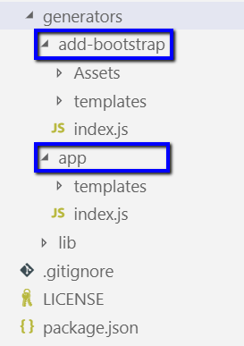
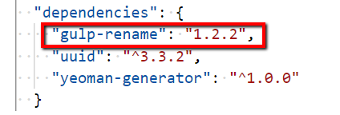
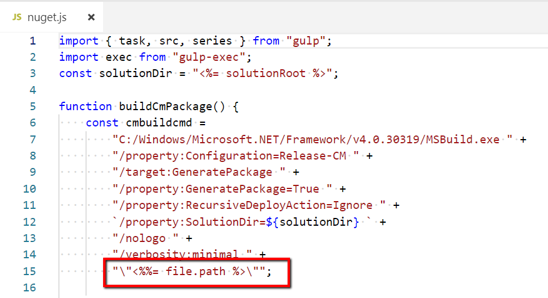
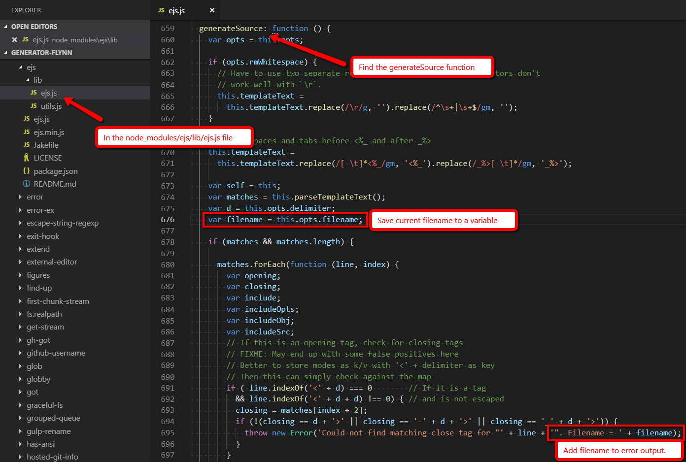
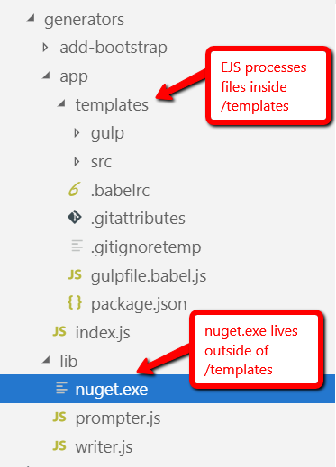

[[snippet]]
| Visual Studio solutions for Sitecore projects are quite complex, as there are multiple integration points to manage. Automating the solution setup process accelerates the time it takes to kick off new projects and enforces consistency across the entire development team.
| 
| This post demonstrates how to use [Yeoman](http://yeoman.io/) to create a custom Sitecore project generator. With Yeoman, we can create a Sitecore solution template that's source controlled and collectively managed. This allows teams to hit the ground running faster, and when a team does something really cool in their project that everyone likes, they can add it to the template so that everyone can benefit from the learnings and the "company standard" can evolve.

## Why use Yeoman?
Yeoman is specifically a framework for generators, so it provides a set of out-of-the-box functions that are very useful when executing generators. For example, it has functions for prompting the user of your generator for variable values and saving these values to a configuration file on disk. And it has functions for dynamically transforming your project template files when the generator is executed. So if you use Yeoman, then the only thing you have to worry about is maintaining the template files for your project.

The second reason why Yeoman is great is because it's easy to use. Once the generator is built, running it is very straightforward. 
Developers can use generators built in Yeoman even if they are not experienced with the inner-workings of Yeoman or the node stack that powers it.

## Why do we need a Sitecore project generator?
Even though each Visual Studio solution that I build for new Sitecore projects has unique requirements, there are certain foundational elements that need to be repeated every time.

### Sample Visual Studio solution checklist
1. C# projects structured in accordance with Helix
 * NuGet references to Sitecore packages based on the Sitecore version of my project
 * Build profiles for server roles
 * Unit test projects
 * Code Style configured (Resharper rules, StyleCop rules, EditorConfig file)
2. TDS projects that parallel my Helixified C# projects
 * TDS validation rules configured
 * Sitecore package generation configured by server roles
 * Assembly inclusion/exclusion configured
3. Front-end assets - Sass compilation, bundling, minification, linting
4. TypeScript library - compilation, bundling, minification, linting
 * Local server configured to test library disconnected from Sitecore (headless)
 * Unit tests,  test runner, and code coverage reporting configured
 * NPM tasks
4. DevOps - Gulp tasks for common DevOps activities like generating a deployable NuGet file from Sitecore update packages

It's very time-consuming and error-prone to build this out manually every time. But what if I told you that all this can be generated for you in a few seconds? Try it out for yourself.

## Run the demo generator
Assuming you have Node installed on your machine, create an empty folder and run the following commands.
``` bash
# installs yeoman globally
npm install yo -g

# installs the Sitecore project generator globally
npm install generator-sitecore-flynn -g

# runs the Sitecore project generator
yo sitecore-flynn
```

The generator will prompt you for some project-specific values:
 * `solutionName` (optional, string) - Ex. "Demo Sitecore Project"
 * `solutionNamespace` (optional, string) - The base .NET namespace for C# projects and classes. Ex. "Demo.Sitecore.Project"
 * `areaName` (optional, string) - The base for the MVC area name. Ex. "DemoArea"
 * `author` (required, string) - Ex. "Anastasiya Flynn"
 * `frontEndAssetPath` (string) - The path to front-end assets directory relative to src/Project/YoBase.Web Ex. "/Assets"
 * `localUrl` (string) - The domain of the local Sitecore instance. Ex. "sc901.local".
  * The generator assumes Sitecore instances are in C:\inetpub\wwwroot\<localUrl>\Website.
  * To change this, update TdsGlobal.config after running the generator.
 * `sitecoreVersion` (select list) - Ex. "9.0 rev. 171219 (9.0 Update-1)"
 * `framework` (select list) - Ex. ".NET 4.6.2"


*Ta-Da!*
You should now have a working solution.
* Open the freshly generated solution in Visual Studio as administrator
* Restore NuGet packages for solution
* Build the solution in Debug, Release-CM, Release-CD
* Run unit tests (the solution comes with 1 test, and it should pass)
* Open Task Runner Explorer and run the `nuget-pack` task - This packs up the Sitecore update packages created by TDS into a deployable NuGet package, which is generated in <solution root>/Artifacts

To see what it's like to run a sub-generator, go back to the terminal and run
``` bash
# runs the Bootstrap sub-generator
yo sitecore-flynn:add-bootstrap
```
The sub-generator will prompt you for permission to modify "package.config", select 'y'.
*Ta-Da Again!*
Your solution now has Bootstrap installed.
* Click refresh in the Task Runner Explorer to load in the new Gulp tasks
* Run the `vendor-copy` task to copy Bootstrap vendor files from the node_modules folder to the project
* Run the `assets-compile` task to compile Sass files to Css
* Run the `assets-serve` task to launch a local Webpack server to test the Bootstrap assets locally

The source code for this generator is available at [GitHub](https://github.com/anastasiya29/yeoman-sitecore-generator). Read on for an explanation of how I built this generator and what it contains (and how you can build one too!).

## Building this custom Sitecore solution generator
This project has been tested with Node.js 8.11.2 (https://nodejs.org/dist/v8.11.2/node-v8.11.2-x64.msi)

### Pre-requisite
The pre-requisite is having an existing Sitecore project that you think is a good candidate to become your standard cookie cutter.

### 1. Define a new node module
Create a new folder for your generator. Initialize a Node module inside this folder by running `npm init`, which will guide you through some questions that are used to generate a `package.json` file. `Package.json` is the module definition file - It declares metadata about your module (like title, description, and version) and it declares 3rd party dependencies and their versions.

A few of things to note about creating Node modules that will become Yeoman generators:
- The package `name` must start with "generator-"
- The `keywords` property needs to contain the phrase “yeoman-generator” in order to show up in searches on yeoman’s site
- A `files` property needs to be added which tells Yeoman which folder to find generators in

All Yeoman generators must declare a dependency on the `yeoman-generator` module. As you build your generator you may end up adding other Node dependencies, as needed. My generator uses the `uuid` module to generate fresh Guids for my Visual Studio projects, and the `gulp-rename` module to dynamically rename files at generation-time.

My final `package.json` looks something like this. You can drop this file into your folder and run `npm install` to download the dependencies.
```json
{
  "name": "generator-sitecore-flynn",
  "description": "Yeoman generator for Sitecore Visual Studio Solutions",
  "author": "Anastasiya Flynn",
  "files": [
    "generators"
  ],
  "keywords": [
    "yeoman-generator",
    "sitecore",
    "helix"
  ],
  "dependencies": {
    "gulp-rename": "1.2.2",
    "uuid": "^3.3.2",
    "yeoman-generator": "^1.0.0"
  }
}
```

Remember to create a folder in your module root called “generators”, which is where Yeoman will look for generators.

### 2. Decide how to break up your generator
Once the Node module is initialized and the dependencies are downloaded, the next step is to decide how to break up your model solution into logical pieces, because you probably don’t want one giant generator for everything. You want a base generator for the stuff that will definitely be used by every project, and then you want sub-generators for the stuff that’s less commonly used.

In my demo, I am grouping the Helixified C# and TDS components into the main generator, and I’m separating out the Bootstrap and TypeScripts parts of the application into sub-generators. This is a great strategy to follow because it means all projects that use my generator won’t have an automatic dependency on Bootstrap or TypeScript.

Inside the “generators” folder, create folders for your main generator and each of your sub-generators.

Within those, you need a file called `index.js` and a folder called `templates`. `index.js` is the JavaScript file that’s executed when you run a specific generator. More on this below. The `templates` folder is where Yeoman looks for templates files for a specific generator. What do I mean by template files?

### 3. Populate templates folders with generator content
Template files are the files that will be used to create your new project. This is where the “custom” part of “custom project generator” comes in. These folders need to be filled with the base structure that’s unique to your company's solution checklist, based on whatever existing project you are using as your model project.

Now, obviously, any existing project is going to have project-specific values scattered throughout, and we need to replace those with variables. When Yeoman runs a generator, it doesn’t just copy and paste all these template files to the destination. It’s a lot smarter. It creates a virtual copy of your templates, and exposes the template stream to you to manipulate and transform. Only once the transforms are done does it write the final version of the templates to disk.

For variables that can be manipulated at generation-time, Yeoman respects `EJS` syntax. [EJS](http://ejs.co/) is a simple templating language. This is an example of what it actually looks like when you replace your project-specific values with EJS variables.

It looks a little complex, but all the work lies in identifying the complete list of project-specific values that need to be replaced with variables. Once you have the list, it’s just a matter of using a find-and-replace tool to do the grunt work. Here is a good starting point of what to look for when you’re making your own list.
* Solution name
* Solution namespace
* MVC area name
* Local Sitecore URL
* Sitecore version
* .NET framework version

### 4. Populate index.js with the generation-time steps
Once the `templates` folders are populated, Yeoman needs to be told how to work with these files. This is done using `index.js`, which is the entry point file that gets run when someone runs your generator.

This file needs to define a class that inherits from Yeoman’s `Generator` class, and this class should expose functions that represent the various steps that the generator needs to do. Yeoman follows a convention-driven approach for function names. Functions that have special names will be prioritized in accordance with this list. So, for example, if you have an function named Initializing and another function named Prompting, then Initializing will run before Prompting.
1. Initializing
2. Prompting
3. Configuring
4. Default
5. Writing
6. Conflicts
7. Install
8. End

If you have functions that don’t match these conventions, they will be run during the Default priority. You can also have private helper functions. Just name them starting with an underscore and Yeoman will ignore them.

Note: It's useful to note that `index.js` is just the entry-point, so you don't have to force all your generator code into this file. You can break up your code across multiple files/classes if you have a really heavy generator - there's no reason a generator can't utilize object oriented architecture. Another benefit to factoring code out into external helpers is that this strategy allows code sharing between the main generator and sub-generators.
```javascript
// my prompting and writing functions are calling out to an external file. The reason
// is that I have factored out some of the operations into external helper classes
// so that they can be re-used again by sub-generators. 
const Generator = require("yeoman-generator"),
    prompter = require("../lib/prompter"),
    writer = require("../lib/writer");

module.exports = class extends Generator {
    constructor(args, opts) {
        super(args, opts);
    }

    // priority functions here
};
```


For a better understanding of what should be done at each step, here is the source from my demo generator with comments explaining what each function is doing.

#### Initializing
```javascript
initializing() {
    // Logs a message indicating the generator has started
    this.log("Generating Sitecore project");

    // Initialize an object to track project-specific settings that change each
    // time the generator runs
    this.settings = {};

    // Escape single backslash with double-backslash for usage in strings
    this.settings.solutionRoot = this.destinationPath().replace(/\\/g, "\\\\") + "\\\\src";
}
```

#### Prompting
```javascript
async prompting() {
    // The prompting step uses yeoman’s prompt function to prompt the developer for
    // project-specific variable values. Yeoman handles all the work of making
    // prompting work, we just need to tell it the list of variables, the text to
    // show to the developer, and whether each variable is required or has a default value.

    // My prompting step is broken up into 2 sub-steps. In this first one, I ask for
    // the Sitecore version, and I present the dev with a list of options.
    await prompter.getSolutionInfo.call(this);

    // In this 2nd one, I ask for the .NET framework version, and I limit the list of
    // options based on the selection that was made for the Sitecore version question.
    // By chaining your prompting questions like this, you can make your prompter
    // intelligent and help developers avoid errors.
    await prompter.getFrameworkInfo.call(this);
}
```

```javascript
function getSolutionInfo() {
    return this.prompt([{
        type: "input",
        name: "solutionName",
        message: "Your solution name",
        default: this.appname // Default to current folder name
    }, ... ,
    {
        type: "list",
        name: "sitecoreVersion",
        message: "Your Sitecore version",
        choices: [
            { name: "8.2 rev. 171121 (8.2 Update-6)", value: "8.2.171121" },
            { name: "8.2 rev. 180406 (8.2 Update-7)", value: "8.2.180406" },
            { name: "9.0 rev. 171219 (9.0 Update-1)", value: "9.0.171219" }
        ],
        required: true,
        store: true
    }]).then((answers) => {
        // Persist all the answers on 'this.settings' object
        Object.keys(answers).forEach((key) => this.settings[key] = answers[key]);
    });
}
```

#### Configuring
```javascript
    configuring() {
        // The configuring step saves all the variable values that have been provided
        // to a config file on disk. This makes them available for reuse by sub-generators
        // that may be run at a future time.
        Object.keys(this.settings).forEach((key) => this.config.set(key, this.settings[key]));
    }
```

#### Writing
```javascript
writing() {
    // The writing step is the main guts of the generator – this is where templates
    // are copied and transformed.
    // First, any files that don’t have a filename, only an extension, like gitignore
    // and editorconfig, need to be copied with a source path and destination path
    // explicitly provided. Otherwise yeoman will ignore these files.
    writer.writeConfigFiles.call(this);

    // Then all the normal files get copied. For these, the source path and destination
    // path do not have to be specified. Yeoman will use the “templates” folder as the
    // source path, and it will use the place where the generator is being run as the
    // destination path. This is when transformations happen. Here, I transform certain
    // filenames based on the namespace variable supplied by the developer.
    writer.writeTemplates.call(this);

    // Finally, copy files that need to bypass EJS processing separately
    writer.writeRawFiles.call(this);
}
```

```javascript
function writeTemplates(src, dist) {

    // This step registers rules for dynamic file renaming. Template files will be
    // renamed based on variable values supplied during the prompting step.
    this.registerTransformStream(rename((path) => {
        path.basename = path.basename.replace(/YoAreaName/g, this.settings.areaName);
        path.basename = path.basename.replace(/YoBase/g, this.settings.solutionNamespace);

        path.dirname = path.dirname.replace(/YoAreaName/g, this.settings.areaName);
        path.dirname = path.dirname.replace(/YoBase/g, this.settings.solutionNamespace);
    }));

    // Here, I create a new object to hold all the project-specific values from the
    // prompting step and some freshly generated GUIDs for C# and TDS projects. This
    // object gets fed into 'this.fs.copyTpl' call in the next line, which processes
    // transforms inside template bodies per EJS syntax.
    const templateData = Object.assign(generateGuids(), this.settings);

    if (src && dist) {
        this.fs.copyTpl(this.templatePath(src), this.destinationPath(dist), templateData);
    } else {
        this.fs.copyTpl(this.templatePath(), this.destinationPath(), templateData);
    }
}
```

#### Install
```javascript
install() {
    // Install node modules in destination
    // After all template files are copied over, the install step calls ‘yarn install’ to
    // resolve all node dependencies in the newly created project.
    this.yarnInstall();
}
```

#### End
```javascript
end() {
    // Logs a message indicating the generator has completed
    this.log("Finished generating Sitecore project");
}
```

The complete source is available on GitHub
[index.js](https://github.com/anastasiya29/yeoman-sitecore-generator/blob/master/generators/app/index.js)
[lib/prompter.js](https://github.com/anastasiya29/yeoman-sitecore-generator/blob/master/generators/lib/prompter.js)
[lib/writer.js](https://github.com/anastasiya29/yeoman-sitecore-generator/blob/master/generators/lib/writer.js)

### 5. Run the generator
Once the templates folders and index.js files are populated, the generator is ready to be executed. You can publish it to NPM, which will make it available publicly like my demo generator, or you can just publish it locally so that only you can run it only on your local machine. Publishing locally is the ideal process during testing - you can publish locally as much as you want. Run this command from the generator module root
```bash
npm link
```

Once the generator is published, create a new folder where you will run the generator, and run it using the command
```bash
yo generator-name
```

### 6. Building sub-generators
From a technical perspectice, sub-generators are exactly the same as the main generator. They also use `index.js` entry point files, convention-driven priority functions, and templates with EJS transforms. But from an architecture perspective, sub-generators require special consideration because unlike the main generator (which runs in an empty folder), sub-generators run in on top of an existing project so they have to be careful to add, rather than to override.

For example, my main generator creates a solution with a Gulp file for Gulp tasks. Both of my sub-generators need to expose additional Gulp tasks, but I have to assume that the Gulp file may be modified with project-specific Gulp tasks by the project team, so I can't just override it. To solve this, I set up the Gulp file to import all tasks from a specific subdirectory, so my sub-generators just need to drop new files into this sub-directory and the solution will automagically detect them.
[gulpfile.babel.js](https://github.com/anastasiya29/yeoman-sitecore-generator/blob/master/generators/app/templates/gulpfile.babel.js)

*Happy generating!*

## Troubleshooting Errors
Below is a collection of errors that I ran into while I was building my generator and of course the solutions that I came up with, in case you encounter these errors too.

### Renaming files at generation-time throws error
If you are using the gulp-rename module to rename files via `registerTransformStream` and you are see the following error, the solution is to pin your `gulp-rename` version to 1.2.2. The error is caused by incompatibility with the newer `gulp-rename`.
```
events.js:183
      throw er; // Unhandled 'error' event
      ^

Error: write after end
```



Reference: [https://github.com/yeoman/yo/issues/577](https://github.com/yeoman/yo/issues/577)

### EJS syntax conflicts with your content
If you need to use the "<%=" characters in your generator content without this being processed by ESJ, the solution is simply to escape syntax "<%%=", which will be rendered as "<%=" when the generator runs.


### EJS syntax causes errors at generation-time
If you encounter an error like this while running your generator, the problem is either that you have a file that uses EJS syntax and the EJS is not properly formatted. Or you have some kind of media file inside your generator content like images, fonts, or executables, and EJS is hiccuping when trying to process these files. Either way, the error message that we get from EJS is frustrating because it doesn't tell you what file it fails on, so it's a nightmare to debug.
```
events.js:183
      throw er; // Unhandled 'error' event
      ^

Error: Could not find matching close tag for "<%".
```

My recommendation for troubleshooting this is to go into the source of the EJS node module (it's located @ /node_modules/esj/lib/esj.js), find the `generateSource` function, add a variable that holds the name of the filename being processed, and then add this filename to the error message. Be aware that these changes will get blown away if you ever update your version of EJS or reinstall your node modules, but for debugging I found this quick and dirty trick to work great.


If you find that the problem is bad EJS syntax, then this is easy to fix. But if the problem is a media file like I mentioned above, my work around is to pull those files out into a folder that's not processed by EJS. For example, my generator content includes a Nuget.exe file, and this was crashing the EJS step. So I moved this files to a folder that's not covered by EJS, and then added a step to my writing function to copy this file using `fs.copy`, which does not do EJS transforms.


```javascript
function writeRawFiles() {
    // Any files that should skip EJS processing
    this.fs.copy(this.templatePath("../../lib/nuget.exe"), this.destinationPath("./lib/nuget.exe"));
}
```

### Template files that are only extensions don't get copied by the generator
Generator content is contained in folders calls "templates" and one of the features of yeoman is that it knows about the special meaning of the "templates" folder, so you can do something like `this.fs.copyTpl(this.templatePath(), this.destinationPath, {})` and yeoman knows to get all the files from "templates" folder recursively and copy them to the folder where the generator is being run. However, that line of code will not copy files that only have an extension (like .gitignore or .editorconfig). My work-around is to copy these files explicitly.
```javascript
function writeConfigFiles() {
    // Any file that only has an extension needs to be copied explicitly
    this.fs.copyTpl(this.templatePath(".gitignoretemp"), this.destinationPath(".gitignore"), this.settings);
    this.fs.copyTpl(this.templatePath(".gitattributes"), this.destinationPath(".gitattributes"));
    this.fs.copyTpl(this.templatePath(".babelrc"), this.destinationPath(".babelrc"));
    this.fs.copyTpl(this.templatePath("./src/.editorconfig"), this.destinationPath("./src/.editorconfig"));
}
```

### .gitignore gets renamed when generator is published to NPM
If you plan on publishing your generator to `npm`, be careful regarding your `.gitignore` files. You probably have some `.gitignore` files inside your generator content, and what I found is that the `npm publish` process renames this file to `.npmignore` which can break your generator. My work-around is to name the file using an alias inside the generator content, and then rename it to the proper name at generation-time.


```javascript
this.fs.copyTpl(this.templatePath(".gitignoretemp"), this.destinationPath(".gitignore"), this.settings);
```

### Error when running gulp tasks
If you encounter the following error when trying to run gulp tasks created by the generator in a terminal, it's most likely not a problem with the generator. You are just missing the gulp command line interface.
```
error "'gulp' is not recognized as an internal or external command"
```

Install it globally with the following command
```bash
npm install -g gulp-cli
```

### Visual Studio's Task Runner Explorer does not detect Gulp tasks
This is most likely not a problem with the generator. See this blog post for solution: [Run Gulp Tasks From the Comfort of Visual Studio](/Visual-Studio/gulp-tasks-in-visual-studio/)


## References
For more details about the different features and options available from Yeoman, read the official [Getting started guide](http://yeoman.io/authoring/index.html).
Also, check out how others are using Yeoman to generate their Sitecore solutions - search for "Sitecore" on [Yeoman's search page](http://yeoman.io/generators/) for even more inspiration.

Bon Appétit!