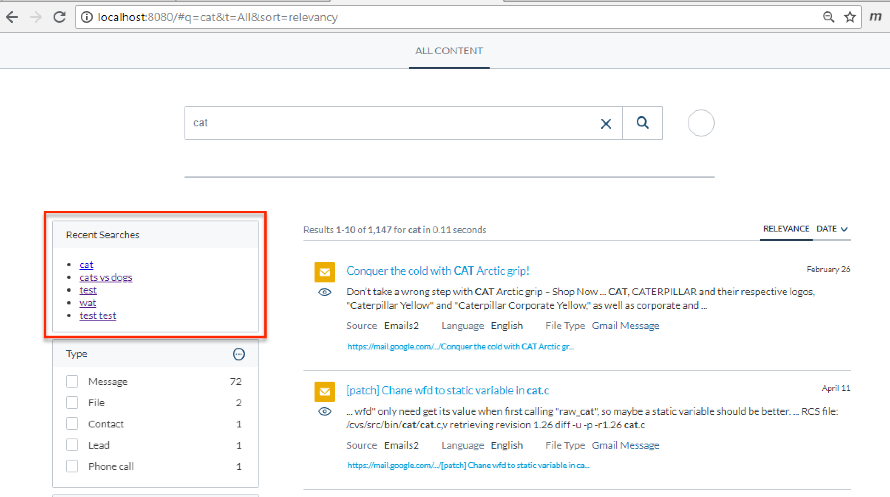

[[snippet]]
| After having a hand in four Coveo for Sitecore projects just this year, I think there is value in creating an open source project for reusable Coveo components. This project has two goals:
| 1. Share components that can be reused by projects across different industries
| 2. Provide implementation references for developers who are learning how to build custom components

## Project repo and documentation
https://github.com/anastasiya29/coveo-components
All Coveo for Sitecore developers are welcome to contribute.

## First set of components

### Recent Searches
[https://github.com/anastasiya29/coveo-components/blob/master/src/Searchbox/RecentSearches.ts](https://github.com/anastasiya29/coveo-components/blob/master/src/Searchbox/RecentSearches.ts)
This component renders a list of terms most recently searched for in a Searchbox.
Developers who use this component in their projects can customize the HTML output of the list using an underscore template.

### Facet Reset
[https://github.com/anastasiya29/coveo-components/blob/master/src/Facet/FacetReset.ts](https://github.com/anastasiya29/coveo-components/blob/master/src/Facet/FacetReset.ts)
This component is a container for a group of Facets, and it renders a button than resets all the Facets inside the container. Multiple FacetReset containers can exist on a page, allowing Facets to be organized into multiple groups.

### Facet Slider For Range
[https://github.com/anastasiya29/coveo-components/blob/master/src/Facet/FacetSliderForRange.ts](https://github.com/anastasiya29/coveo-components/blob/master/src/Facet/FacetSliderForRange.ts)
This component is a Facet Slider for range data. For example, if your search results are product categories, and each category covers a range of prices. The range data use-case was covered in detail in this post:
[Extending Coveo's "Numeric Slider Facet" Component to Search Over Multiple Fields](/Sitecore/Coveo/coveo-custom-slider-facet-pt1/)

Bon Appétit!