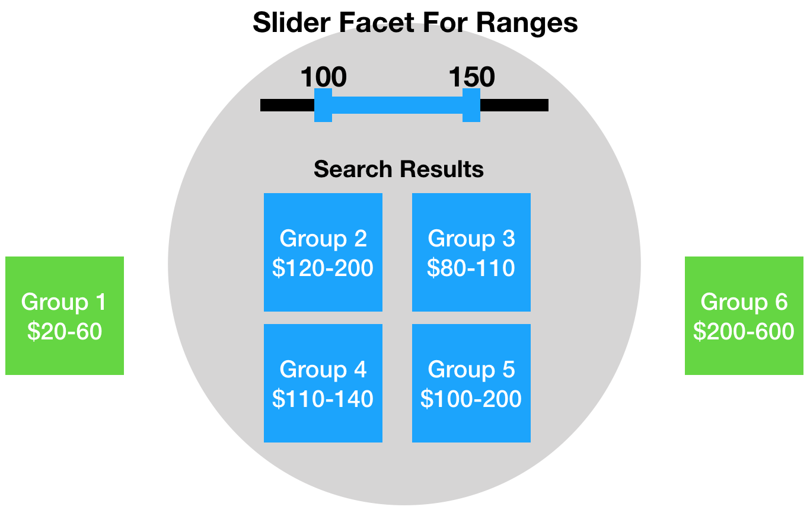
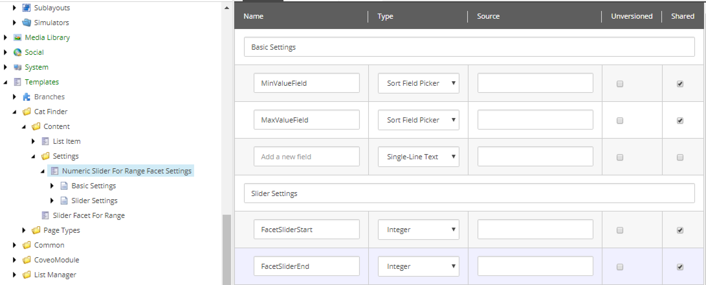
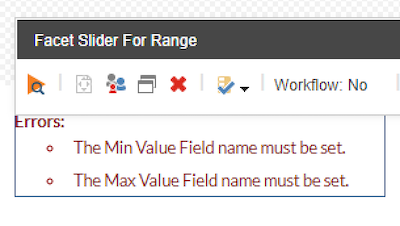
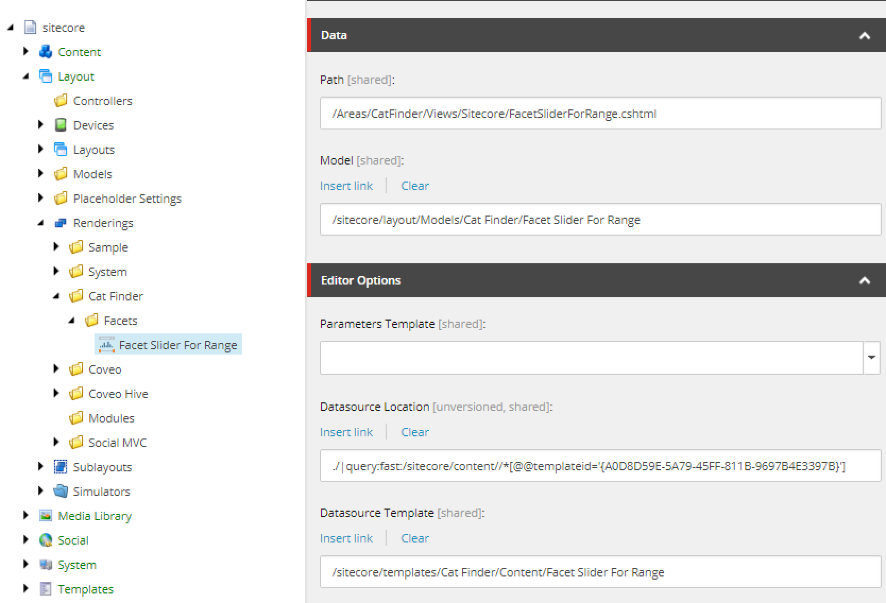

[[snippet]]
| Today we will build a custom Coveo slider facet that filters based on whether the numeric range of a Sitecore item overlaps with the numeric range specified by the user. We will extend an out-of-the-box Hive rendering with extra fields and validation. This tutorial assumes you know the basics of working with the Coveo for Sitecore Hive framework.


## Out-of-the-box Coveo Hive
Coveo for Sitecore is a very feature-rich framework that ships with several configurable facet components for filtering your search results. The out-of-the-box facets support most common use-cases. For example, if our items have a "Price" field, we can use the `Numeric Slider Facet` or `Numeric Range Facet` components to show only the items whose Price value falls within the user-defined range.

## The challenge
But what if our search result items are associated with a range of prices? For example:
* If we are building a search for a multi-brand site that shows different Product Families or Brands as results. Each result represents multiple products, so it correlates to a range of prices.
* If we are building a search for a travel site that shows different flight paths as results. Each result represents a variety of plane ticket options, so it correlates to a range of prices.

## The solution
To filter this type of data we need to get our hands a little dirty and create a custom facet component - one that determines whether a range of values on a Sitecore item falls within a range specified by the user. I call this component `Slider Facet For Range`. Our strategy will be to create 2 computed fields - 1 for the minimum value and 1 for the maximum value - and extend the slider facet to query against both fields.

Note:
My implementation was tested on the May 2018 release of Coveo for Sitecore. 

## Let's code!
### Investigate the out-of-the-box slider
`Coveo Numeric Slider Facet` rendering is a View Rendering that uses `/sitecore/layout/Models/Coveo Hive/Facets/Coveo Facet Slider` as the model and `/sitecore/templates/Coveo Hive/Facets/Coveo Numeric Facet Slider` as the datasource.

The purpose of the model is to read the user-configured parameters on the datasource and pass them to the JavaScript framework. We will need to add some custom parameters, so let's start by creating a custom model and a custom datasource template.

### Create custom datasource templates
We don't want to re-use the settings template that the default slider template inherits from because it contains a field called `FacetFIeld`, which defines the single field used by the facet. Instead, we need a settings item that defines 2 fields, 1 for the minimum value and 1 for the maximum value.

Create a new template called `Numeric Slider For Range Facet Settings`


Mark the `MinValueField` and `MaxValueFields` fields as required.


Create a new template called `Facet Slider For Range` and add the following as Base Templates:
* `/sitecore/templates/Coveo Hive/Base UI Component`
* `/sitecore/templates/Coveo Hive/Base UI Component`
* `Numeric Slider For Range Facet Settings`

This inheritance chain gives our datasource all the fields and settings from the base component except `FacetField`, and we gain 2 new fields - `MinValueField` and `MaxValueField`

### Create custom model to process our datasource and settings
Create an item in /sitecore/layouts/Models called `Facet Slider For Range`. On the backend, Coveo handles models with complex inheritance by using interfaces. Following the Coveo pattern, our backend classes look like this:

`FacetSliderForRangeProperties` to parse our custom settings
``` csharp
namespace Project.Areas.AreaName.Models
{
    using Coveo.UI.Components.ModelProperties.Facets;
    using Coveo.UI.Components.SearchUiProperties;
    using Coveo.UI.Components.SearchUiProperties.PropertySerializer;
    using Coveo.UI.Components.SitecoreProperties;

    public class FacetSliderForRangeProperties : FacetSliderProperties
    {
        [SitecoreProperty("MinValueField")]
        [SearchUiProperty(Prebind = "fieldTranslator", PropertySerializer = typeof(FieldNameSerializer))]
        public string MinField { get; set; }

        [SitecoreProperty("MaxValueField")]
        [SearchUiProperty(Prebind = "fieldTranslator", PropertySerializer = typeof(FieldNameSerializer))]
        public string MaxField { get; set; }
    }
}
```

`FacetSliderForRangeModel` to associate datasource model with settings model, to specify the Coveo CSS class, and to specify validation rules
``` csharp
namespace Project.Areas.AreaName.Models
{
    using Coveo.UI.Components.Models;
    using Coveo.UI.Components.ModelValidators;

    public interface IFacetSliderForRangeModel : IFacetSliderForRangeModel<FacetSliderForRangeProperties>
    {
    }

    public interface IFacetSliderForRangeModel<out T> : IModelWithProperties<T>, IModelWithRawProperties, IBaseComponentModel
        where T : FacetSliderForRangeProperties, new()
    {
    }

    /// <summary>
    /// This class is based on Coveo.UI.Components.Models.Facets.FacetSliderModel
    /// </summary>
    public class FacetSliderForRangeModel : FacetSliderForRangeModel<FacetSliderForRangeProperties>, IFacetSliderForRangeModel
    {
    }

    public class FacetSliderForRangeModel<TFacetSliderProperties> : BaseModelWithProperties<TFacetSliderProperties>, IFacetSliderForRangeModel<TFacetSliderProperties>
        where TFacetSliderProperties : FacetSliderForRangeProperties, new()
    {
        public override string CssClass => "CoveoFacetSliderForRange";

        protected override void OnPropertiesInitialized()
        {
            AddOnValidationHandler(() => new FacetSliderForRangePropertiesValidator(Labels, Properties));
            AddOnValidationHandler(() => new ComponentWithDataSourceValidator(this));
        }
    }
}
```

### Add validation for custom parameters
Coveo shows validation messages in Experience Editor when a datasource is missing required fields. Following the Coveo pattern, we need to create a validator for our custom parameters (it's used by the `FacetSliderForRangeModel` class in `OnPropertiesInitialized`)
``` csharp
namespace Project.Areas.AreaName.Models
{
    using Coveo.UI.Components.ModelValidators;
    using Coveo.UI.Core.ErrorReports;
    using Coveo.UI.Core.Strings;
    using Sitecore.Diagnostics;

    /// <summary>
    /// This class is based on Coveo.UI.Components.ModelValidators.Facets.FacetSliderPropertiesValidator
    /// </summary>
    public class FacetSliderForRangePropertiesValidator : IComponentModelValidator
    {
        private readonly FacetSliderForRangeProperties properties;
        private readonly ILocalizedStringFetcher localizedStringFetcher;

        public FacetSliderForRangePropertiesValidator(ILocalizedStringFetcher localizedStringFetcher, FacetSliderForRangeProperties properties)
        {
            Assert.IsNotNull(localizedStringFetcher, "localizedStringFetcher");
            Assert.IsNotNull(properties, "properties");
            this.properties = properties;
            this.localizedStringFetcher = localizedStringFetcher;
        }

        public void AddToReport(IErrorReport errorReport)
        {
            Assert.IsNotNull(errorReport, "errorReport");

            if (string.IsNullOrEmpty(this.properties.MinField))
            {
                errorReport.AddError(this.localizedStringFetcher["The Min Value Field name must be set."]);
            }

            if (string.IsNullOrEmpty(this.properties.MaxField))
            {
                errorReport.AddError(this.localizedStringFetcher["The Max Value Field name must be set."]);
            }
        }
    }
}
```

With this validator class in place, inserting the `Slider Facet For Range` component without filling in the min and max fields will result in errors like this:


Note:
The text in the error message comes from Dictionary entries, so this is compatible with multi-lingual sites.

### Create the rendering definition item
Add a rendering definition item to /sitecore/layout/Renderings/ called `Facet Slider For Range`. Use the model and datasource that we created earlier.


This view is a copy of the base component view, except that it uses our custom class as the Model.
``` html
@using Coveo.UI.Components
@using Coveo.UI.Components.Extensions
@model Project.Areas.AreaName.Models.IFacetSliderForRangeModel

@*This view is based on \Website\Views\Coveo Hive\Facets\Coveo Facet Slider.cshtml*@

@Html.Coveo().RenderErrorSummary(Model.ValidateModel())

@if (Model.IsConfigured)
{
    @Html.Partial(Partials.DEBUG_INFORMATION, Model)
    <div id='@Model.Id'
         class="@Model.CssClass"
         @foreach (var property in @Model.RawProperties) {
             @: data-@(property.Key)='@(property.Value)'
         }>
    </div>
}
```

### Create computed fields for the minimum and maximum values
Once the new component has been added to the page, you can configure it in the same way you would configure the base component ([Full list of Facet Slider properties](https://developers.coveo.com/display/public/SitecoreV3/Facet+Slider+Component+Properties)). Additionally, you will need to specify the names of the min field and max field. Use the field names from the computed field definition.

``` xml
<configuration xmlns:patch="http://www.sitecore.net/xmlconfig/" xmlns:set="http://www.sitecore.net/xmlconfig/set/">
  <sitecore>
    <coveo>
      <defaultIndexConfiguration>
        <fieldMap>
          <fieldNames hint="raw:AddFieldByFieldName">
            <fieldType fieldName="pricemin" returnType="System.Double" type="System.Double" isMultiValue="false" isDisplayField="true"  isFacet="true" includeForFreeTextSearch="false" settingType="Coveo.Framework.Configuration.FieldConfiguration, Coveo.Framework" />
           <fieldType fieldName="pricemax" returnType="System.Double" type="System.Double" isMultiValue="false" isDisplayField="true"  isFacet="true" includeForFreeTextSearch="false" settingType="Coveo.Framework.Configuration.FieldConfiguration, Coveo.Framework" />
          </fieldNames>
        </fieldMap>
        <documentOptions>
          <fields hint="raw:AddComputedIndexField">
            <field fieldName="pricemin">Project.Search.ComputedFields.PriceMinComputedField,Project</field>
            <field fieldName="pricemax">Project.Search.ComputedFields.PriceMaxComputedField,Project</field>
          </fields>
        </documentOptions>
      </defaultIndexConfiguration>
    </coveo>
  </sitecore>
</configuration>
```

You can explicitly specify the min and max values of the facet range using the `FacetSliderStart` and `FacetSliderEnd` fields. Or you can leave these fields blank to allow the component to dynamically generate the range based on the lowest value in min field and the highest value in max field.

## Wrap-up
Now that all of our Sitecore items and C# classes are set up, we can add our custom facet to the search page and use the custom parameters to define min and max fields that the facet should filter on.

## Up Next
In the next post we will transition to the JavaScript side of customizing Coveo. We will go over how to create a custom TypeScript component that uses lazy loading and extends from Coveo.FacetSlider.
[Go to Part 2](/coveo-custom-slider-facet-pt2/)

Bon Appétit!
