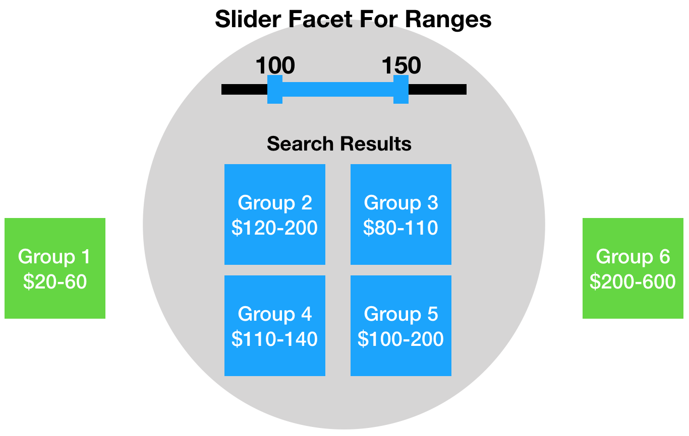

[[snippet]]
| Today we will finish building a custom Coveo slider facet that filters based on whether the numeric range of a Sitecore item overlaps with the numeric range specified by the user. In [Part 1](/coveo-custom-slider-facet-pt1/) we extended an out-of-the-box Hive slider facet with extra fields and validation by creating Sitecore items and code-behind classes for the new rendering and settings. Today we will focus on my favorite part of the customization process - the JavaSript portion.


## Summary of part 1
Our goal is to build a slider facet that queries against 2 fields - `minprice` and `maxprice`. This allows us to use facets on search results that are associated with a range of prices. In the last post, we
* Defined a new rendering called `Slider Facet For Range`
* Created a datasource template that has all the fields and settings from the base component except `FacetField`, plus 2 new fields - `MinValueField` and `MaxValueField`
* Added computed fields for `minprice` and `maxprice`
* Defined the Coveo CSS class as `CoveoFacetSliderForRange`

## Let's code!
Now that our new component is on the page and the index contains the minimum and maximum price of each item, all that's left is to extend how the slider renders itself and how it sends queries to the Coveo API.

Following the conventions set forth by the CSS class, our TypeScript component is named `FacetSliderForRange`.

### Lazy initialization
If you haven't had a chance to work with Coveo Hive yet, you might be used to the legacy way of extending components:
``` javascript
export class CustomFacet extends Coveo.Facet {
    static ID = 'CustomFacet';

    constructor(public element: HTMLElement, public bindings: IComponentBindings) {
        super(element, CustomFacet.ID, bindings);
    }
}

Initialization.registerAutoCreateComponent(CustomFacet);
```

Depending on which component you are extending, you might get an error ("Uncaught TypeError: Cannot read property of undefined") if you try to use the above template in a Hive implementation. That's because Hive components load asynchronously on an as-needed basis - referred to as "lazy loading" in the framework.

Coveo's [Facet Slider component](https://coveo.github.io/search-ui/components/facetslider.html) utilizes lazy loading, so we can inherit from it only after we ensure that it finished initializing.
``` javascript
export default function lazyFacetSliderForRange(): Promise<IComponentDefinition> {
    return Coveo.load<IComponentDefinition>('FacetSlider').then(() => {
        class FacetSliderForRange extends Coveo.FacetSlider {
            public static ID = 'FacetSliderForRange';

            constructor(public element: HTMLElement, public options: IFacetSliderOptions, bindings?: IComponentBindings, private slider?: Slider) {
                super(element, options, bindings);
            }
        };

        Coveo.Initialization.registerAutoCreateComponent(FacetSliderForRange);
        return FacetSliderForRange;
    });
};

Coveo.LazyInitialization.registerLazyComponent('FacetSliderForRange', lazyFacetSliderForRange);
```

### Extend the base options
On the Sitecore and C# side, we jumped through a few inheritance hoops to replace the `FacetField` setting with the `MinValueField` and `MaxValueField` settings. We could have just left the `FacetField` alone and simply ignored it, but having a legacy field floating around might have been confusing to authors. On the JavaScript side, however, the `FacetField` setting is still a required field because a lot of the base code depends on it. So we need to
1. Create `IFacetSliderForRangeOptions`, which extends `IFacetSliderOptions`, and defines `minField` and `maxField` settings
2. When calling the base constructor, use the `minField` value as the `field` value
``` javascript
class FacetSliderForRange extends Coveo.FacetSlider {
    public static ID = 'FacetSliderForRange';

    static options: IFacetSliderForRangeOptions = {
        minField: ComponentOptions.buildFieldOption({
            groupByField: true,
            required: true,
            section: 'CommonOptions'
        }),
        maxField: ComponentOptions.buildFieldOption({
            groupByField: true,
            required: true,
            section: 'CommonOptions'
        })
    };

    static initOptions = (options: IFacetSliderForRangeOptions) => {
        options.field = options.minField;
        return options;
    };

    constructor(public element: HTMLElement, public options: IFacetSliderForRangeOptions, bindings ? : IComponentBindings, private slider ? : Slider) {
        super(
            element,
            FacetSliderForRange.initOptions(ComponentOptions.initComponentOptions(element, FacetSliderForRange, options)),
            bindings);
    }
};
```

### Use 2 fields when querying the API
The base component initializes the [`FacetQueryController`](https://github.com/coveo/search-ui/blob/master/src/controllers/FacetQueryController.ts) class to manage interactions with the API. This class has a strict expectation of only dealing with 1 field. It would be nice to inherit from `FacetQueryController` to get around the 1 field limit, but `FacetQueryController` is initialized in the constructor of `FacetSlider` so plugging in a custom class is not simple.

The good news is that the code for generating the API query is isolated in `FacetQueryController.computeOurFilterExpression`, so we can monkey-patch this function to create the 2 field query.
``` javascript
function extendFacetQueryController(orig: FacetSliderQueryController, minField: string, maxField: string) {
    const base = {
        computeOurFilterExpression: orig.computeOurFilterExpression.bind(orig)
    };
    orig.computeOurFilterExpression = function computeOurFilterExpression(boundary) {
        var result = base.computeOurFilterExpression(boundary);
        if (result) result += (" OR " + result.replace(minField, maxField));
        return result;
    }
}
```

This function calls the base implementation, which returns a query like "minpricefieldname==100..150", and it transforms this into a query like "minpricefieldname==100..150 OR maxpricefieldname==100..150". Whatever is created by this function gets added to the "advanced query" part of the API call. You can find more info on Coveo Query Syntax here - [https://onlinehelp.coveo.com/en/ces/7.0/user/coveo_query_syntax_reference.htm](https://onlinehelp.coveo.com/en/ces/7.0/user/coveo_query_syntax_reference.htm).

In the FacetSliderForRange constructor:
``` javascript
extendFacetQueryController(this.facetQueryController, String(this.options.minField), String(this.options.maxField));
```

If you explicitly specified the start and end values of your slider in the component datasource, then you can stop here. But if you need the slider to generate dynamically based on the lowest value in `minField` and the highest value in `maxField` then continue on to the next section.

### Generate start and end dynamically based on 2 fields
We can determine the lowest value in `minField` and the highest value in `maxField` by sending a one-time group-by request to the Coveo API during initialization. For details on using group-by, see [https://developers.coveo.com/display/public/SearchREST/Group+By+Parameters](https://developers.coveo.com/display/public/SearchREST/Group+By+Parameters).
``` javascript
constructor(...) {
    super(...);

    // Using oneRootElement instead of onRootElement to call this handler only one time
    this.bind.oneRootElement(QueryEvents.doneBuildingQuery, (args: IDuringQueryEventArgs) => this.onFirstQuery(args));
}

private onFirstQuery(args: IDuringQueryEventArgs) {
    args.queryBuilder.groupByRequests.push(FacetSliderForRange.getGroupByRequest(String(this.options.maxField), "maximum"));
    args.queryBuilder.groupByRequests.push(FacetSliderForRange.getGroupByRequest(String(this.options.minField), "minimum"));
}

private static getGroupByRequest(field: string, operation: string): IGroupByRequest {
    return {
        completeFacetWithStandardValues: true,
        field: field,
        generateAutomaticRanges: true,
        maximumNumberOfValues: 1,
        sortCriteria: "nosort",
        "computedFields": [{
            field: field,
            operation: operation
        }]
    };
}
```

Group-by requests return the field's range as a string like this "100..150". The min/max can be parsed from this string with a simple regular expression, but I had success with trying the [Computed Field Parameter](https://developers.coveo.com/display/public/SearchREST/Computed+Field+Parameters) to get a numeric value for min or max, respectively.
``` javascript
constructor(...) {
    super(...);

    // Using oneRootElement instead of onRootElement to call this handler only one time
    this.bind.oneRootElement(QueryEvents.querySuccess, (args: IQuerySuccessEventArgs) => this.onFirstQuerySuccess(args));
}

private onFirstQuerySuccess(args: IQuerySuccessEventArgs) {
    // Search the group-by response for the items that deal with maxField, then find the one that has our computed field result
    var maxFieldGroupBy = args.results.groupByResults.filter((x) => ("@" + x.field) === this.options.maxField).some((x) => {
        if (x.globalComputedFieldResults && x.globalComputedFieldResults.length) {
            this.options.end = x.globalComputedFieldResults[0];
            return true;
        }

        return false;
    });

    // Search the group-by response for the items that deal with minField, then find the one that has our computed field result
    var minFieldGroupBy = args.results.groupByResults.filter((x) => ("@" + x.field) === this.options.minField).some((x) => {
        if (x.globalComputedFieldResults && x.globalComputedFieldResults.length) {
            this.options.start = x.globalComputedFieldResults[0];
            return true;
        }

        return false;
    });

    if (maxFieldGroupBy && minFieldGroupBy) {
        super.reset();
    } else {
        throw new Error("FacetSliderForRange.onFirstQuerySuccess: could not identify start or end value");
    }
}
```

### Putting it all together
Complete source: [FacetSliderForRange.ts](https://github.com/anastasiya29/coveo-components/blob/master/src/Facet/FacetSliderForRange.ts)

## Demo
Here is the `Slider For Range Facet` in action in my Cat Finder demo site. The strategy of the site search is to match users to organizations rather than cats because the available set of cats is always changing. Each organization maintains listings of cats available for adoption, and each cat is assigned an adoption fee. The `Slider For Range Facet` allows us to filter organizations by fee range eventhough the organizations are associated with multiple different fees. Since the `Slider For Range Facet` inherits from `Coveo.FacetSlider`, it renders with the same CSS classes as the base component, so it leverages the our-of-the-box Coveo styling.


Bon Appétit!