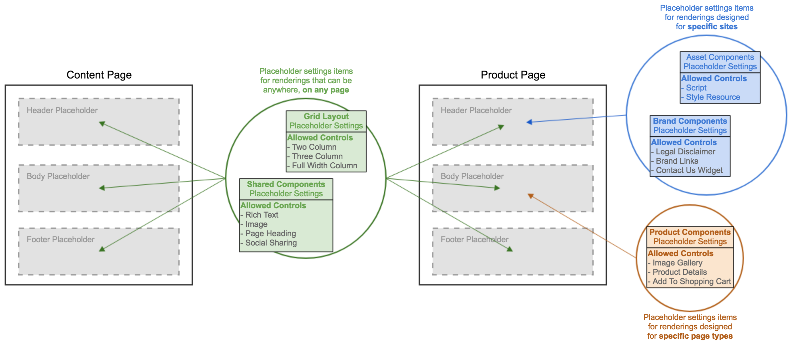

[[snippet]]
| > **This post is part of a series**
| > 1. [Structuring placeholder keys and settings in a multi-site Sitecore implementation using out-of-the-box functionality](/Sitecore/multisite-placeholder-settings-strategy)
| > 2. **Custom pipeline processor to allow dynamically binding multiple placeholder settings items to a single placeholder key**
| 
| Building upon the Placeholder Overrides functionality described in the [last post](/Sitecore/multisite-placeholder-settings-strategy), this post describes a small customization that enables any page template to bind multiple placeholder settings items to the same placeholder key. This is very useful in multi-site implementations.



<!-- more -->

## Recap of placeholder overrides
A placeholder override, or dynamic placeholder, is when the `Placeholder Key` field on a placeholder settings item is left blank, and the settings item is attached to a key at the page template level. Using this method, a placeholder settings item can be attached to one or multiple keys, on one or multiple pages.

Dynamic placeholders eliminate placeholder conflicts between sites because they allow sites to reuse placeholder keys while changing what renderings are allowed to be inserted.

## The value of binding multiple placeholder settings items to a single placeholder key
The diagram above shows an example of how placeholder settings can be broken up. The value of breaking up `Allowed Controls` into groups is that it centralizes control, making changes to placeholders easier to manage. By defining a dynamic placeholder settings item that groups shared components, you can bind it to multiple placeholder keys on your pages. Then, adding or removing a shared rendering becomes a simple matter of updating the central settings item.

The success of this strategy is greatly improved by allowing multiple `Allowed Controls` groups to bind to the same placeholder key. Then you can mix and match your groups depending on the site and page type, as shown in the diagram.

## Vanilla Sitecore
In vanilla Sitecore, when you're editing a page in Experience Editor and you select some placeholder, the `GetAllowedRenderings` pipeline processor tries to find a placeholder settings items for the selected placeholder, and it short circuits after finding the first match. We can examine the `Sitecore.Pipelines.GetPlaceholderRenderings.GetAllowedRenderings` and `Sitecore.Layouts.PageContext` classes (from `Sitecore.Kernel` assembly) to see exactly how this works. This is the gist...

```csharp
namespace Sitecore.Pipelines.GetPlaceholderRenderings {
class GetAllowedRenderings {}
    public void Process(GetPlaceholderRenderingArgs args) {
        var placeholderKey = [the placeholder key that the user selected, retreived from args]
        var database = [the current database, retreived from args]
        var layoutDefinition = [the layout field for the current context item, retreived from args]

        // Gets the first placeholder settings item attached to the selected placeholder key
        var placeholderItem = PageContext.GetPlaceholderItem(placeholderKey, database, layoutDefinition)

        var renderings = [gets all the renderings defined in the placeholderItem's 'Allowed Controls' field]

        // Saves the results to the pipeline args
        args.PlaceholderRenderings = renderings;
    }
}
}
```
```csharp
namespace Sitecore.Layouts {
class PageContext {
    public Item GetPlaceholderItem(string placeholderKey, Database database, string layoutDefinition) {
        var placeholderDefinitions = [Gets the list of placeholder definitions specified in the layoutDefinition]

        // Loop over the definitions to find the first one that matches the user's placeholderKey
        foreach (var placeholderDefinition in placeholderDefinitions) {
            [if the placeholderDefinition key matches placeholderKey then return this definition]
        }
    }
}
}
```

## Custom processor
To allow a placeholder key to pull renderings from multiple placeholder settings items, we need to replace Sitecore's `GetAllowedRenderings` processor with a custom one. Instead of calling `PageContext.GetPlaceholderItem`, which returns only the first Placeholder settings match, we call a modified static method `GetPlaceholderItems` that returns *all* matches.

We ensure that the list of placeholder settings items is distinct by using a custom equality comparer created specifically for Sitecore items.

Once we have the final list of placeholder settings items, we get the list of allowed renderings from their `Allowed Controls` fields. We ensure the list of renderings is distict by using the custom equality comparer again.

The full source (with comments), along with configuration patch file and Sitecore item equality comparer can be downloaded from BitBucket - 
https://bitbucket.org/anastasiya29/sitecore-customizations/src/master/Sitecore.Module.SharedPlaceholders/

Or download the source as a [Sitecore package](https://bitbucket.org/anastasiya29/sitecore-customizations/raw/d850fc332f85e577e0fdb46bd0f153abc22bab12/Sitecore.Module.SharedPlaceholders/dist/Sitecore.Module.SharedPlaceholders-1.0.zip) to install in your instance. Current version tested on Sitecore 8.0, 8.1, and 8.2.

Bon Appétit!