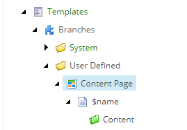
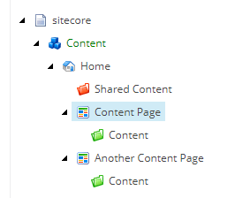
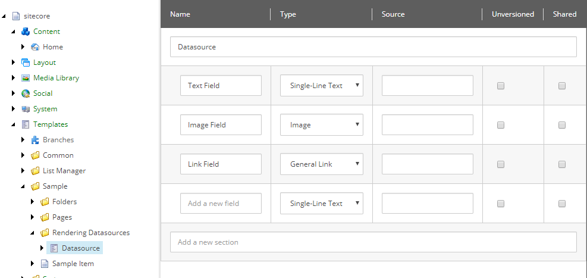
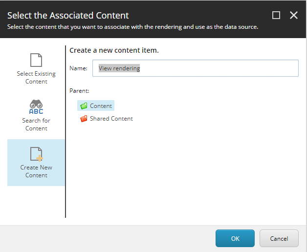
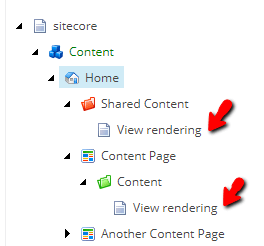
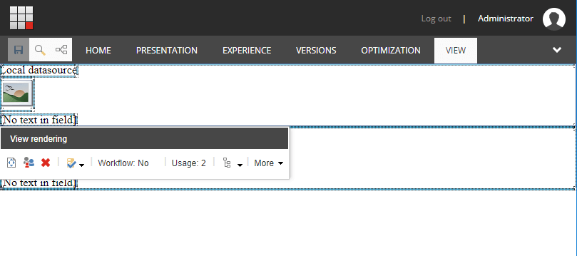
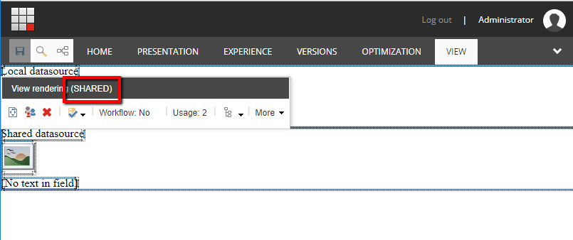

[[snippet]]
| This blog post covers how to inject extra metadata text into Experience Editor. One of the great uses of this metadata text it to help content authors see a visual difference between renderings that use local datasources and renderings that use shared datasources.

## Introduction - How Shared Content Folder Work
It's common practice for Sitecore projects to organize content items (rendering datasources) into different Content folders that denote whether the content is page-specific or shared. For example, the project I'm currently working on has a structure like this:
``` text
sitecore/
└── Content/
    ├── Program Name/
    |   ├── Asia/
    |   |   ├── Region Shared Content/
    |   |   └── Page Name/
    |   |       └── Page Name/
    |   |            └── Content/
    |   ├── Europe/
    |   |   ├── Region Shared Content/
    |   |   └── Page Name/
    |   |       └── Page Name/
    |   |            └── Content/
    |   └── North America/
    |       ├── Region Shared Content/
    |       └── Page Name/
    |           └── Page Name/
    |                └── Content/
    └── Global Shared Content/
```

As you can see, we have "Content" folders under each page, which hold the content items specific to that page (an example of what would go here is a datasource for a Page Heading component). We have "Region Shared Content" folders under each region item, which hold content items that are shared across a single region (an example of what would go here is a datasource for a Header or Footer component). And finally, we have "Global Shared Content", which holds content items shared across all pages in all regions (an example of what would go here is a datasource for a Cookie Dislaimer Alert component).

Unfortunately, when the Content Authors are editing a rendering datasource from Experience Editor, they don't know which Content folder this datasource lives in unless they open up rendering Properties dialog and inspect the path of the datasource item, which is not convenient.

The solution to this problem is actually very easy, and it will take us longer to setup vanilla Sitecore to show the demo than to write the demo itself ☺

## Let's code!

### Set up Sitecore
* Install a vanilla instance of Sitecore (I'm using verion 8.2 update 6 right now, but the specific version doesn't really matter for this demo)

* Create an MVC Layout with a single placeholder called "main"


Contents of `MainLayout.cshtml`
``` html
<!DOCTYPE html>
<html lang="en">
<head>
    <meta charset="utf-8">
</head>
<body>
    <div>@Html.Sitecore().Placeholder("main")</div>
</body>
</html>
```

* Create a new page template called "Content Page" which uses the custom MVC Layout


* Create two new templates for content folders called "Page-Specific Content" and "Shared Content". Make them inherit from /Templates/Common/Folder and give them distinct icons


* Since each instance of Content Page will need to have a Page-Specific Content folder as a child, create a branch template for this and add this branch template to the insert options of the Home page


* Insert an instance of "Shared Content" as a child of Home, and insert a couple of Content Pages. Your content tree should look like this


* Create a new template for a datasource item


* Create a new View Renderings called "View rendering" and set it to reference our custom datasource. Note the value in the "Datasource Location" field; more on this later.

Contents of `SimpleViewRendering.cshtml`
``` html
<div>@Html.Sitecore().Field("Text Field")</div>
<div>@Html.Sitecore().Field("Image Field")</div>
<div>@Html.Sitecore().Field("Link Field")</div>
```

* Create a placeholder settings item that permits our View Renderings to be inserted into the "main" placeholder

### Set up local and shared content
* The value we specified for "Datasource Location" of the rendering definition item is special because it lets the Content Authors chose whether their datasource should be local or shared at the time when they are inserting new components into the page.
```
query:./*[@@templateid='{AA7140CB-54A5-4D69-8EE7-E370638960CF}']|query:/sitecore/content/Home/*[@@templateid='{F320B812-0603-4172-A7DF-027313B6CAA4}']
```

* Open up one of your Content Page instances in Experience Editor and insert a View Rendering component. You should see a dialog like this


* Insert two instances of View Rendering into the page. Make one use a datasource in the local folder and make the other use a datasource in the shared folder. Your Sitecore tree should look like this:


### The solution - Visually differentiate between local and shared datasources
* The box that shows up around a rendering in Experience Editor is called a "chrome", and we can inject extra data into chromes by adding a custom `getChromeData` pipeline.

Contents of custom config file in `Website/App_Config/Include/'
``` xml
<configuration xmlns:patch="http://www.sitecore.net/xmlconfig/">
  <sitecore>
	  <pipelines>
		  <getChromeData>
			  <processor patch:after="processor[@type='Sitecore.Pipelines.GetCromeData.GetPlaceholderChromeData, Sitecore.Kernel']" type="Website.Pipelines.InjectExperienceEditorMetaData" />
		  </getChromeData>
	  </pipelines>
  </sitecore>
</configuration>
```

Contents of the backend class referenced by the config file
``` csharp
using System;
using Sitecore.Data;
using Sitecore.Diagnostics;
using Sitecore.Pipelines.GetChromeData;

namespace Website.Pipelines
{
	public class InjectExperienceEditorMetaData : GetChromeDataProcessor
	{
		private readonly ID _sharedContentTemplateId = ID.Parse("{..id-of-your-shared-folder-template..}");

		public override void Process(GetChromeDataArgs args)
		{
			Assert.ArgumentNotNull(args, "args");

			// Potential values of args.ChromeType include: EditFrame, Field, Placeholder, Rendering
			if (args.ChromeType.Equals("Rendering", StringComparison.InvariantCultureIgnoreCase))
			{
				var query = $"./ancestor::*[@@tid=\"{_sharedContentTemplateId}\"]";
				var contentFolder = args.Item.Axes.SelectSingleItem(query);
				if (contentFolder != null)
				{
					args.ChromeData.DisplayName += " (SHARED)";
				}

				// add extra checks if you have more levels of Shared Content folders
			}
		}
	}
}
```

What's happening here is we are looking for chromes of Renderings, then we use a query to figure out which Content folder the current Rendering Context item lives in, and then we append extra text to the chrome DisplayName if the Rendering Context item is in a Shared content folder.

> **Notes**
> * We are injecting extra data when `args.ChromeType == "Rendering"`, but there are other values that `args.ChromeType` can have. For example: `EditFrame`, `Field`, `Placeholder`, `Rendering`. This means you can utilize the `getChromeData` pipeline for solving a broad range of use cases.
> * Also note that you can adapt this code to support additional level of "Shared" content, such as my example from the introduction.
> * You can improve the code snippet by using text from the Sitecore Dictionary rather than hardcoding the text "(SHARED)"

### View the result
* Refresh the Experience Editor, and select each instance of the View Rendering components. Observe that when you select the local component, the chrome displays "View rendering". When you select the shared component, the chrome displays "View rendering (SHARED)".





Bon Appétit!