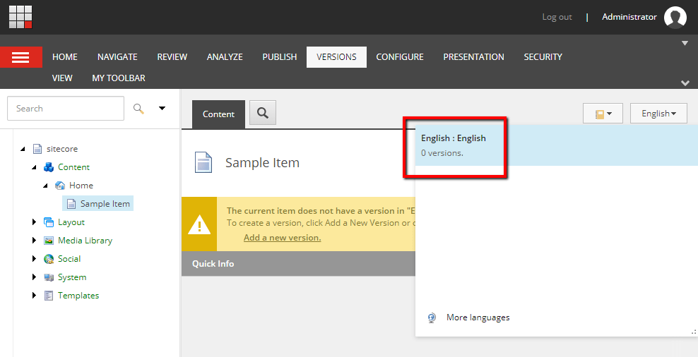

## The Missing Language Version Problem
[[snippet]]
| Sitecore allows us to delete all language versions from an item, so it's possible for items to end up in an invalid state.


<!-- more --> 

## How Can Items Have No Language Versions?
One way this can happen is if you programatically cleaned up all instances of a specific language. For example, if you used Powershell to delete all instances of "en" in favor of using "en-US".

## Common Powershell Commands Can't Help Us
When there are items in the Sitecore tree that don't have any language versions, we cannot filter out these items using common Powershell commands like `Get-ChildItems`. This is because Powershell implicitly uses "en" as the language when the `-Language` parameter is not specified. So if you try to find items which have no language versions by omiting the `-Language` parameter, you will end up with a list of "en" items instead. If you try using an empty string for the `-Language` parameter, it will return all versions of items that have language versions, which is the opposite of what we want.

## The Powershell Solution
The solution is to get a bit clever, and search for items that have a collective count of all language versions equal to 0. First, I used `$item.Versions.GetType()` to get the .Net class name of the object I’m working with. After decompiling the class, I discovered it has a method `GetVersions(bool includeAllLanguages)` that returns an array of items. This is the perfect method to leverage since I can test for an empty count to determine if it’s one of the items that's missing language versions.
``` powershell
# point this to the root of your website
$folder = "/sitecore/content"

# you can combine the Where-Object clause with other tests
# like Name or Template if you are looking for something specific
$items = Get-ChildItem -Path $folder -recurse | `
Where-Object { $_.Versions.GetVersions($true).Count -eq 0 } | `
%{
        [PSCustomObject]@{
            "ID" = $_.ID
            "ItemName" = $_.Name
            "Item" = $_
            "ItemPath" = $_.Paths.Path
        }
}

# this will print out any results that it finds
$items
```

Bon Appétit!