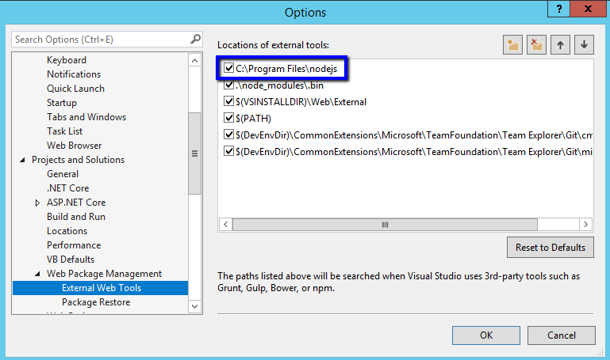
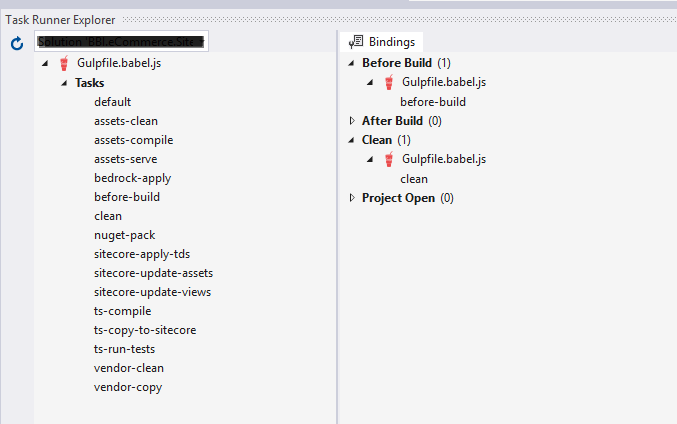

[[snippet]]
| If you are a back-end Sitecore or .NET developer who spends most of your time inside Visual Studio, and your project utilizes gulp tasks, then I'm sure you understand the convenience of the `Task Runner Explorer`. This window allows running gulp tasks from within Visual Studio, and (even cooler) it allows binding specific tasks to MS Build targets. There's just a couple steps needed to get this window to work correctly.

## Configure Visual Studio
Visual Studio comes bundled with its own version of Node.js, but it's an older, incompatible version.  You must configure Visual Studio to use the newer version. To do so:
1. You should have a newer version of Node installed on your local machine. I am using Node.js 8.11.2 (https://nodejs.org/dist/v8.11.2/node-v8.11.2-x64.msi)
2. Open the External Web Tools options dialog at `Tools` -> `Options` -> `Projects and Solutions` -> `Web Package Management` -> `External Web Tools`.
2. Add `C:\Program Files\nodejs` to the top of the list.


## Explore your Gulp tasks in Visual Studio
Now, if you have a gulp file in the root of your solution, Visual Studio will automatically detect it and load the tasks. Even if the gulp tasks are split up between multiple files, as long as the main gulp file imports all the tasks Visual Studio will detect them. (You may need to click the Refresh icon in the top left corner of the Task Runner Explorer). You can double click on any task to run in.


## Bind Gulp tasks to a MSBuild targets
Finally, a very useful feature is being able to bind to MSBuild targets like `BeforeBuild` and `Clean`. You just need to add a comment to the top of your gulp file which specifies which tasks to bind to which target. For example, in this case the "before-build" gulp taks will run every time the solution is build. This task is responsible for compiling front end assets, so it's something the rest of the project depends on.

```javascript
/// <binding BeforeBuild="before-build" Clean="clean" />
```


Bon Appétit!