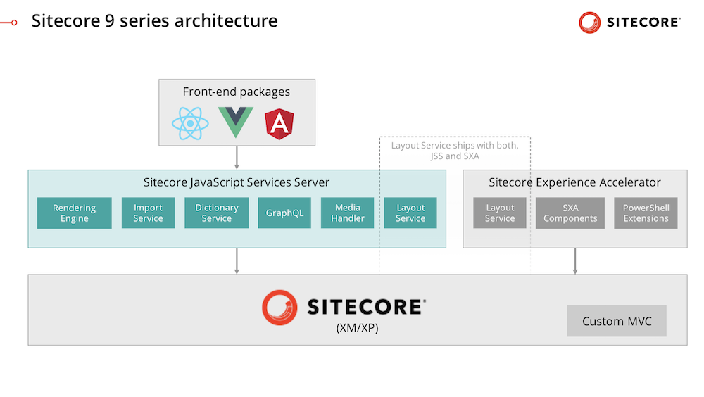
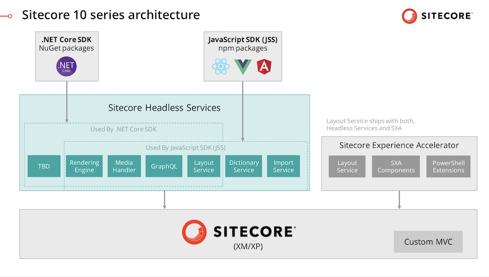

# JSS 14 - Don’t Call It a ComeBack
Hey friends,

[[snippet]]
| It’s probably seems like Sitecore’s `JavaScript SDK` (JSS) has been on the back burner since the last release. And yes, you read that right, JavaScript SDK (formerly known as JavaScript Services) got a little naming update to align better with its new `.NET Core SDK` cousin. 
| 
| Before I go any further, I want to acknowledge our wonderful community, who definitely has not taken any breaks. They have kept up blogging, making videos, presenting at virtual user groups, doing demos for us (🥰), and lighting Slack on 🔥🔥 - keeping the knowledge sharing and innovation going strong. The JSS team and I want you all to know how much we appreciate the collaboration.
| 
| Now, on to business. There have actually been big things happening in JSS behind the scenes.

## Nick is back!!
If you’re been working with Sitecore for a while, I’m sure you know and love [Nick Wesselman](https://twitter.com/techphoria414). 

He was part of the original JSS core dev team, never wears the same hair length twice, and you may remember him from popular hits like “HedgieCorn” and  “Friends don’t let friends use Habitat as a starter.” Also he’s a [cat owner](https://twitter.com/techphoria414/status/1255989723845230594) ([Dog too](https://twitter.com/techphoria414/status/1249766921819557888), but that’s not relevant). Anyway…

In addition to answering pretty much every JSS question on Slack recently and helping build the new Developer Experience for you C# people,

Nick has recently taken over as Product Manager of JSS. This totally makes sense since he was already managing Headless Services, ASP.NET Core Rendering SDK, and Sitecore CLI, so having a unified team and roadmap is great for the future of HX (Headless Experience. Yes, I said it).

## Same `Headless Services`, new architecture
Speaking of Headless Experience… not only are the new tools for .NET developers and the new .NET Core rendering SDKs inspired by JSS, they are actually built on top of what used to be known as `JSS Server Components`.

> From Sitecore’s [Developer Tools Documentation](https://doc.sitecore.com/developers/100/developer-tools/en/sitecore-headless-services.html):  
> The Sitecore Headless Services (formerly the  JSS Server Components) provides the APIs needed for the  Sitecore ASP.NET Rendering SDK .  
>   
> You can install Sitecore Headless Services in the following ways:  
>   * In an on-prem Sitecore installation as a Sitecore package  
>   * In a cloud Sitecore installation as a Web Deploy Package using the Sitecore Azure Toolkit  
>   * In a Sitecore container using Dockerfiles  

This means that [Headless Services](https://doc.sitecore.com/developers/100/developer-tools/en/sitecore-headless-services.html) encompasses key JSS elements like [Layout Service](https://doc.sitecore.com/developers/100/developer-tools/en/sitecore-layout-service.html) and [GraphQL](https://doc.sitecore.com/developers/100/sitecore-experience-manager/en/graphql.html).  Plus, see that box that says “TBD”? That’s future stuff! Sitecore’s investment into innovation and improvements of Headless Services will benefit clients of both, the JavaScript SDKs and the .NET Core SDKs. Cool, right?

**Why is it cool?**

1. Anything built with Headless SDKs is more aligned with the development ideology and patterns of SaaS platforms, which is where [Sitecore and our customers are headed](https://www.sitecore.com/company/news-events/press-releases/2019/11/sitecore-saas-strategy/saas-faq).

2. Learning development approaches that share a core codebase and value the same principles reduces on-boarding overhead for developers. So once you learn the “Sitecore Headless way,” it will be easier to understand both approaches, so you can be better at recommending the right approach to your clients based on their business needs. 

**Totes cool…**

## La roadmap…
(Yes, I’m putting the good stuff on the bottom so ya’ll have to scroll through all my memes)
With Nick at the helm of All Things Headless, the JSS backlog has experienced quite the growth spurt. We’ve been discussing the interviews I’ve done with dev teams for the Best Practices Guide so he can get a better idea of what the needs and wants of the community are.

As far as next release, what we know for sure is that improving SSR performance is a high priority item. This will enable JSS clients to scale higher with a smaller infrastructure. Expect to see upgrades on this front.

Additionally, we are hearing Contract-First Mode come up over and over. We know that working Contract-First speeds up development, so we agree that automating contract generation would be a great feature. But we’d like to hear more about the different ways that teams envision Contact-First working. How are you doing it now? Has it created any new challenges?

*Wait, did she say Best Practices Guide?*

## JSS Guides and Recommended Practices RFC
(Request for Comments)

JSS is powering live sites across different business verticals, and as more developers join the JSS community, the top request we get is to provide a “Best Practices Guide.”

We are proud to announce that after countless hours of research and development team interviews, we are ready to submit the first version of `JSS Guides and Recommended Practices` to you, our community, for your review and feedback. We examined patterns that we noticed in successful teams who feel more productive using JSS, and the complaints that we heard from teams who faced challenges with JSS. These guides are a collection of our learnings.
 
Please review the [**Guides and Recommended Practices preview**](https://jss-docs-preview3.herokuapp.com/guides/). We welcome your feedback, questions, change suggestions, and additional content.  We’ve create GitHub issues for the 7 topic categories to facilitate group discussion. Contribution instructions are outlines in the issues.

* [Thinking in JSS](https://github.com/Sitecore/jss/issues/432)
* [Code Patterns](https://github.com/Sitecore/jss/issues/433)
* [Multisite Scenarios](https://github.com/Sitecore/jss/issues/434)
* [Performance](https://github.com/Sitecore/jss/issues/435)
* [Debugging](https://github.com/Sitecore/jss/issues/436)
* [GraphQL](https://github.com/Sitecore/jss/issues/437)
* [WIP](https://github.com/Sitecore/jss/issues/438)

To tell us about your ideas for `Contract-First` workflow, check out [Developer Workflows Guide: Contract-First](https://jss-docs-preview3.herokuapp.com/guides/thinking-in-jss/developer-workflows#contract-first), and post in the [Thinking In JSS](https://github.com/Sitecore/jss/issues/432) issue.

Did we miss a major topic? Does something need more details? Do you like having `docs` and `guides` content separate? Post in the `WIP` issue.

**Thank you, `#SitecoreJSS` community!!**

---

Bon Appétit!
