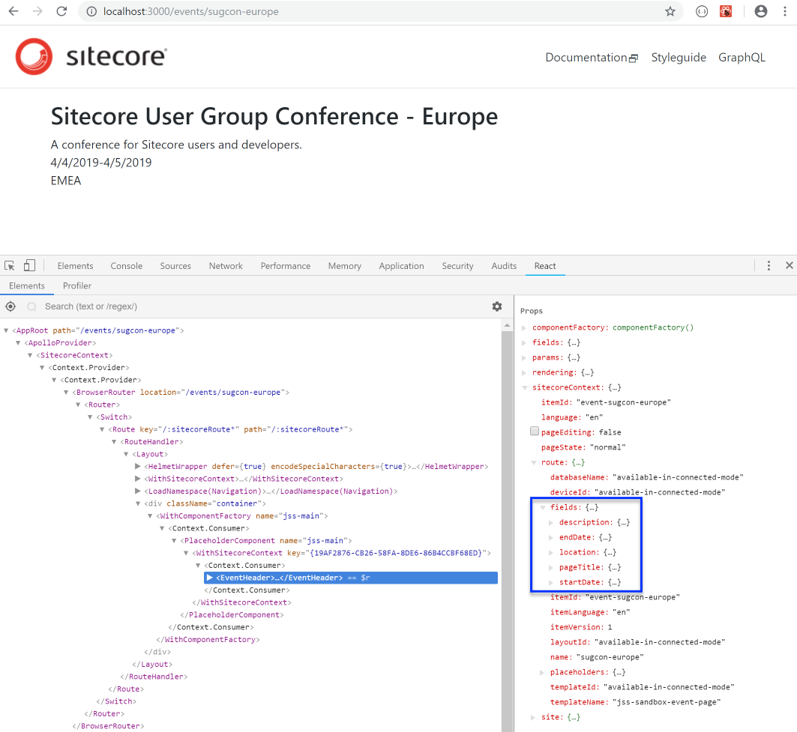

[[snippet]]
| This post is part of a series - [Sitecore JavaScript Services (JSS) Sandbox](/jss-sandbox/)
| 
| My "jss-sandbox" site is going to showcase upcoming Sitecore community events. But before I could start the fun part of building components, I needed to create some mock content.

## Adding a new route definition
First, I created a new route type using `manifest.addRouteType` . This defined route-level fields specific to event pages. Note that there’s no field for title because `pageTitle` is inherited from the default route. Most of the fields are simple inline types, except `location`, which a reference field to another content item.
sitecore\definitions\routes\EventRoute.sitecore.js
```javascript
import {
  CommonFieldTypes,
  SitecoreIcon
} from "@sitecore-jss/sitecore-jss-manifest";
import packageJson from '../../../package.json';

export default function (manifest) {
  manifest.addRouteType({
    name: "jss-sandbox-event-page",
    displayName: "JSS Sandbox Event",
    icon: SitecoreIcon.Microphone,
    fields: [
      {
        name: "description",
        type: CommonFieldTypes.RichText,
        displayName: "Event Description",
        required: false
      },
      {
        name: "startDate",
        type: CommonFieldTypes.DateTime,
        displayName: "Event Start Date",
        required: true,
        standardValue: "$now"
      },
      {
        name: "endDate",
        type: CommonFieldTypes.DateTime,
        displayName: "Event End Date",
        required: false,
        standardValue: "$now"
      },
      {
        name: "location",
        type: CommonFieldTypes.ItemLink,
        displayName: "Event Location",
        source: `dataSource=/sitecore/content/${packageJson.config.appName}/Content/locations`,
        required: false
      }
    ]
  });
}
```

## Adding a new route
Using my custom event route type, I was ready to create routes for event pages. I created a directory structure based on my desired URL structure (domain\events\event-name) and added a yaml file for an event route. I also created content items for location tags.
```
data
	routes
		events
			sugcon-europe
				en.yml
	content
		locations
			amer
				en.yml
			apac
				en.yml
			emea
				en.yml
```

I assigned a custom route type to the sugcon-europe route by referencing `jss-sandbox-event-page` in the  `template` property, and I assigned a location by referencing the location tag item id in the `fields.location.id` property.

data\routes\events\sugcon-europe\en.yml
```yaml
id: event-sugcon-europe
template: jss-sandbox-event-page
fields:
  pageTitle: Sitecore User Group Conference - Europe
  description: A conference for Sitecore users and developers.
  startDate: '2019-04-04T08:00:00.000Z'
  endDate: '2019-04-05T17:00:00.000Z'
  location:
    id: locations-emea
placeholders:
  jss-main:
  - componentName: EventHeader
```

## Adding a component for displaying and editing route-level fields
I needed a way to display route-level fields on event pages. I wasn’t sure how to achieve this yet, so I started off with an EventHeader component and hardcoded HTML.
```
jss scaffold EventHeader
```

src\components\EventHeader\index.js
```jsx
import React from 'react';

const EventHeader = () => (
  <div>
    Header Component
  </div>
);

export default EventHeader;
```

Since this component was for rendering route fields, it didn’t need any fields of its own.
sitecore\definitions\components\EventHeader.sitecore.js
```javascript
import { SitecoreIcon, Manifest } from '@sitecore-jss/sitecore-jss-manifest';

export default function (manifest) {
  manifest.addComponent({
    name: 'EventHeader',
    displayName: 'Event Header',
    icon: SitecoreIcon.DocumentTag,
    fields: [],
  });
}
```


## All route ancestors need language versions
At this point, I wanted to make sure my event routes were working before I added more events. I fired up my local JSS server using the `jss start` command… and got smacked with this error.

```bash
> [DICTIONARY] served in en
> [LAYOUT] Layout for route '/events/sugcon-europe' was not defined. Returning 404.
```

The problem was that I didn’t have a route definition (yaml file) for the parent directory.  To resolve the error, I needed to add an `en.yml` file under data\routes\events. This makes sense from a Sitecore perspective - all ancestors of a page need to have a version in the current language, or the current page won’t load.
```
data
	routes
		events
			en.yml
			sugcon-europe
				en.yml
```


## Using ‘withSitecoreContext ‘ to access route-level fields from a component
In JSS, values for route-level fields are defined in the route’s yaml/json file. By default, these values are not passed down to the route’s components’ props.

I inspected the props received by the EventHeader component in React developer tools, and saw that the `rendering.fields` property was populated with an empty collection. This made sense since EventHeader doesn’t define any fields.


So how can the component access route-level fields?

JSS provides a helper called `withSitecoreContext` for accessing route data. Import it into your component and use it like this.
```jsx
import React from 'react';
import { withSitecoreContext } from '@sitecore-jss/sitecore-jss-react';

const ComponentName = ({ sitecoreContext }) => (
	...
);

export default withSitecoreContext()(ComponentName);
```

Adding `sitecoreContext` to EventHeader allowed me to display all the event page fields. 
```jsx
import React from 'react';
import { Text, RichText, DateField } from '@sitecore-jss/sitecore-jss-react';
import { withSitecoreContext } from '@sitecore-jss/sitecore-jss-react';

const EventHeader = ({ sitecoreContext: { route: { fields } } }) => (
  <div>
    <Text tag="h2" field={fields.pageTitle} />
    <RichText field={fields.description} />
    <DateField field={fields.startDate} render={date => date.toLocaleDateString()} />
    -
    <DateField field={fields.endDate} render={date => date.toLocaleDateString()} />
    <p>
      Location: <Text field={fields.location.fields.value} />
    </p>
  </div>
);

export default withSitecoreContext()(EventHeader);
```



## Other applications of ‘withSitecoreContext’
Notice that `sitecoreContext` has some other interesting properties like
* `sitecoreContext.pageEditing`
* `sitecoreContext.site.name`
* `sitecoreContext.route.templateId`
These properties can be utilized when you need your component to render different HTML depending on the context. For example, ensuring that error state messages are visible in Experience Editor mode so that authors can edit the error text.

## Lessons Learned
* A route definition (yaml/json file) needs to exists for all ancestors of a route. It’s ok if it’s blank; it just needs to exist. Otherwise, the route cannot be rendered.
* The `withSitecoreContext` helper gives components access to route data like editor mode, template ID, and route fields.

## Try It Yourself
To experiment with this code yourself, you can clone it locally

```bash
git clone -b topic/create-page-routes https://github.com/anastasiya29/jss-sandbox.git
```

Remember to install the `jss cli` if you haven’t already done so, and run `npm install` from the project root to download dependencies. After that, use `jss start` to launch the app in your browser in disconnected mode.

Bon Appétit!