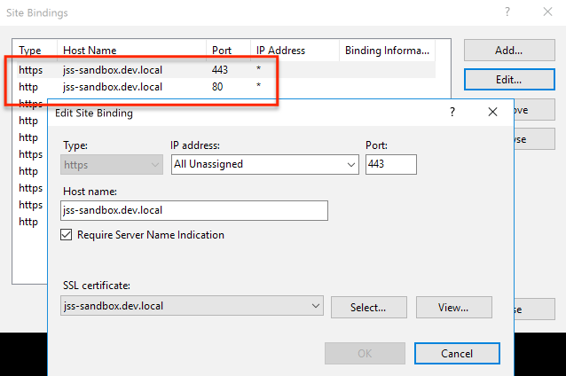
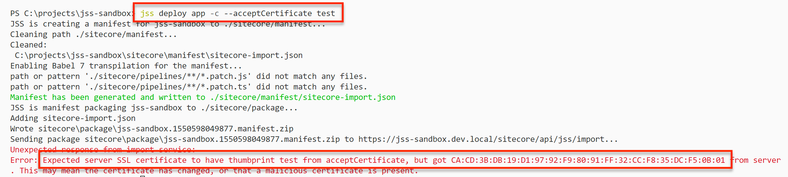
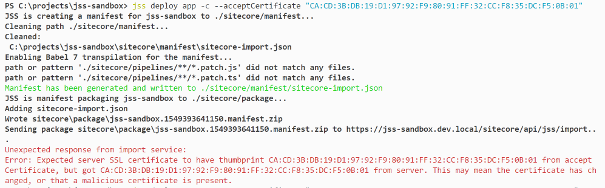
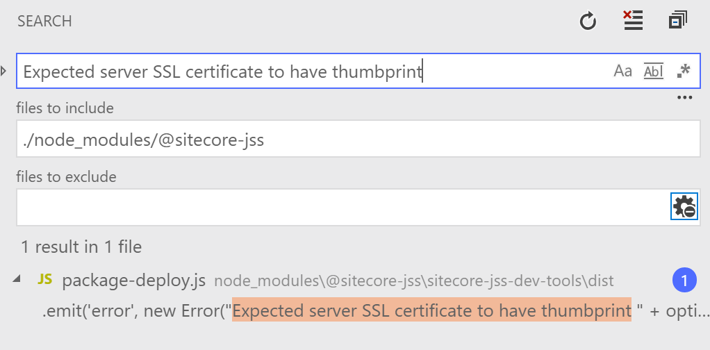
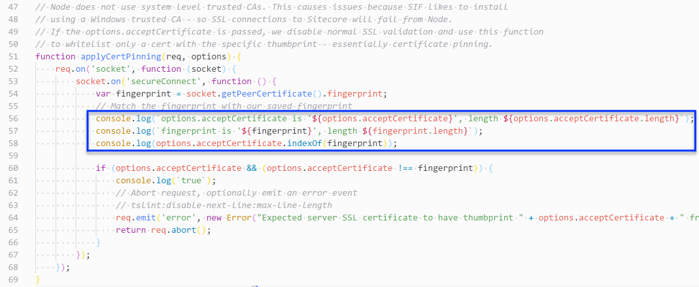
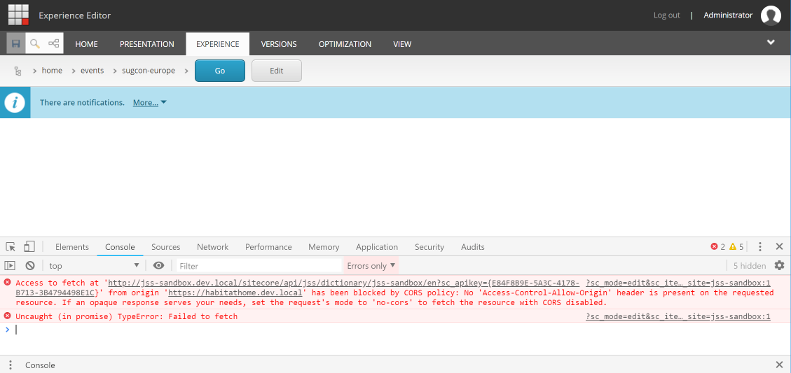
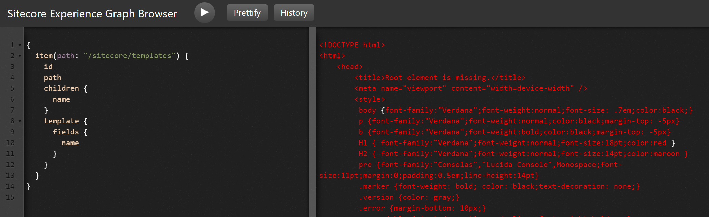
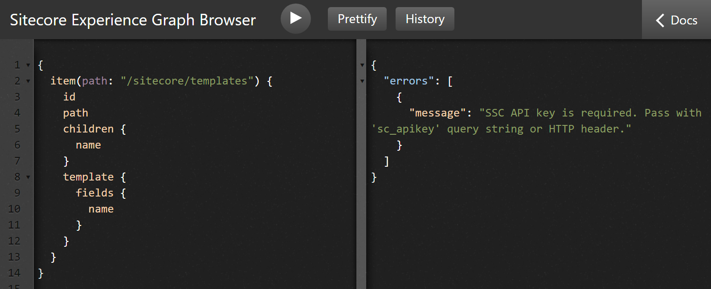

This post is part of a series - [Sitecore JavaScript Services (JSS) Sandbox](/jss-sandbox/)

## Disconnected vs Connected
[[snippet]]
| Similar to disconnected mode, connected development mode also runs your JSS app on a local server (http://localhost:3000). The difference is that in disconnected mode the app is hydrated with content from yaml/json files, but in connected mode the app is hydrated with content from Sitecore.
| 
| To run connected mode, I needed to deploy my app to Sitecore, which did not go smoothly. This post covers the errors I experienced and how I solved them.


## Pre-reqs for deployment
My scenario: I had an existing Sitecore 9.1 instance installed on my machine, which housed an [SXA](https://doc.sitecore.com/users/sxa/17/sitecore-experience-accelerator/en/introducing-sitecore-experience-accelerator.html) website. I wanted to deploy my JSS app as a new, sibling website into this instance.

To set up a new website in Sitecore, I registered a new hostname in IIS and hosts file (instructions here: [App Deployment: Configure your app’s site and host name](https://jss.sitecore.com/docs/getting-started/app-deployment#step-1-configure-your-apps-site-and-host-name)). Additionally, since my Sitecore instance is configured to enforce SSL, I added a second binding in IIS which referenced a self-signed certificate.


I created an API key and generated a `scjssconfig.json` file with `jss setup` per instructions in the docs:
[App Deployment: API Key](https://jss.sitecore.com/docs/getting-started/app-deployment#step-2-api-key)
[App Deployment: Setup connection information](https://jss.sitecore.com/docs/getting-started/app-deployment#step-1-setup-connection-information)

I created two new configs in `\App_Config\Include\`. The first (jss-sandbox.config), which was generated when I created the app with `jss create`, contains a standard Sitecore site definition, plus JSS app registration and GraphQL endpoint registration. The second (jss-sandbox.deploysecret.config), which was printed as the output of the `jss setup` command, contains the app’s deployment secret.

## Deployment
With configuration of hostname and API key completed, I was ready to deploy my app to my local Sitecore instance using `jss deploy app --includeContent`
([App Deployment: Local Sitecore Instance](https://jss.sitecore.com/docs/getting-started/app-deployment#31-local-sitecore-instance))

### Redirect error
My deployment failed with the following error
```bash
Sending package sitecore\package\jss-sandbox.1549391965277.manifest.zip to http://jss-sandbox.dev.local/sitecore/api/jss/import...
Sitecore has accepted import task JSSImport-jss-sandbox-1:39:25 PM
Unexpected response from import status service. The import task is probably still running; check the Sitecore logs for details.
Moved Permanently
<head><title>Document Moved</title></head>
<body><h1>Object Moved</h1>This document may be found <a HREF="https://jss-sandbox.dev.local/sitecore/api/jss/import/status?appName=jss-sandbox&amp;jobName=JSSImport-jss-sandbox-1:39:25%20PM&amp;after=0&amp;appName=jss-sandbox&amp;jobName=JSSImport-jss-sandbox-1:39:25%20PM&amp;after=0">here</a></body>
```

I tried hitting the URL from the error message in the browser and saw the “Your connection is not private” warning that’s typically seen when there’s something wrong with the SSL certificate. It’s easy to bypass this warning in the browser, but I needed a way for the JSS deployment to bypass it too.

Turns out there’s an extra flag that can passed to `jss deploy` to achieve this.  From release notes:
> jss deploy items (and deploy app) can now accept a --acceptCertificate parameter that whitelists a SSL certificate by thumbprint (certificate pinning). Because Node does not respect Windows trusted root certificates, this enables deploying items to local Sitecore instances that use self-signed certificates without disabling SSL validation entirely.  
[Release Notes: Sitecore JSS 11.0 for Sitecore 9.0 and 9.1](https://jss.sitecore.com/release-notes#sitecore-jss-110-for-sitecore-90-and-91)

It’s possible to view the certificate in IIS to get the thumbprint, but I found that the easier and better way is to run something like `jss deploy app -c --acceptCertificate test`. It’s ok to replace “test” with any string, it doesn’t matter. The point is to input the wrong thumbprint so that JSS shows an error message with the expected thumbprint. The reason this method is better is because the thumbprint format that’s in IIS and the thumbprint format that JSS expects are different.


From this error message, I copied out the certificate thumbprint in the expected format and formulated the command that I now use to do my local deployments `jss deploy app -c --acceptCertificate CA:CD:3B:DB:19:D1:97:92:F9:80:91:FF:32:CC:F8:35:DC:F5:0B:01`

### Certificate thumbprint error
It’s worth noting that the first time I tried the above command, it failed mysteriously. I didn’t understand why it was failing. As you can see from the error message, the thumbprint that I was sending and the thumbprint it expected appear to match perfectly.


To debug this, I used VSCode’s “Find in Folder” feature to find which JSS file throws the error I was seeing (Note: if you don’t see results, check for an exclusion rule for the node_modules directory in settings).


Using this technique, I found the file that compares the certificate thumbprints, and I added a few `console.log` statements to get a clue on what’s going on.
`node_modules\@sitecore-jss\sitecore-jss-dev-tools\dist\package-deploy.js`

There is no build step needed when new code is added to node modules in this manner; it becomes part of the module automatically. However, it will be overwritten if the module is ever upgraded.

Output:
```bash
options.acceptCertificate is '‎CA:CD:3B:DB:19:D1:97:92:F9:80:91:FF:32:CC:F8:35:DC:F5:0B:01', length 60
fingerprint is 'CA:CD:3B:DB:19:D1:97:92:F9:80:91:FF:32:CC:F8:35:DC:F5:0B:01', length 59
1
```

As can be seen from the command output, the problem was that there was an unprintable ANSI character at the beginning of my input string. Apparently, this happens when the thumbprint is copied from IIS’s certificate manager. Running the string through notepad cleared up the bad character and allowed a successful deployment.

## Post-Deployment
After the successful deployment, I tried validating the deployment by opening my pages in integrated mode (Experience Editor) and connected mode (`jss start:connected`).

### CORS error
Both modes showed CORS errors in the console.

```bash
1. Access to fetch at ‘http://jss-sandbox.dev.local/sitecore/api/jss/dictionary/jss-sandbox/en?sc_apikey={E84F8B9E-5A3C-4178-B713-3B4794498E1C}' from origin 'https://habitathome.dev.local' has been blocked by CORS policy: No 'Access-Control-Allow-Origin' header is present on the requested resource. If an opaque response serves your needs, set the request's mode to 'no-cors' to fetch the resource with CORS disabled.
?sc_mode=edit&sc_itemid={68901727-7BAD-561B-B3A9-05B579043018}&sc_lang=en&sc_version=1&sc_site=jss-sandbox:1
2. Uncaught (in promise) TypeError: Failed to fetch
```

As the error message states, the problem was that Sitecore was trying to access the JSS API at an http endpoint from an https domain. The fix was to make sure https was used everywhere. API endpoints are defined in `scjssconfig.json`.
```json
{
  "sitecore": {
    ...
    "deployUrl": "https://jss-sandbox.dev.local/sitecore/api/jss/import",
    "layoutServiceHost": "https://jss-sandbox.dev.local"
  }
}
```

### GraphiQL errors
In addition to validating integrated and connected modes, I also wanted to verify the GraphQL endpoint. But alas, a couple more error to resolve.


`[XmlException: Root element is missing.]` - I’m glad Kam on the product team quickly recognized this, because this was another mystery error. This happens when being logged into Experience Editor in the same browser session as Graphiql. Hey, at least this one is easy to resolve.


`SSC API key is required. Pass with 'sc_apikey' query string or HTTP header.` - For this error, I had to add an [SSC API key](https://doc.sitecore.net/sitecore_experience_platform/developing/developing_with_sitecore/sitecoreservicesclient/api_keys_for_the_odata_item_service)  to Sitecore and pass the key GUID to the query request via `sc_apikey={GUID}`
[Sitecore GraphQL API: Setting up Sitecore GraphQL](https://jss.sitecore.com/docs/techniques/graphql/graphql-overview#setting-up-sitecore-graphql)

## Lessons Learned
* To debug errors from the JSS node module, search for the error message in `node_modules\@sitecore-jss`, then add logging in the appropriate files.
* Use `jss deploy` together with the `—acceptCertificate ` flag to deploy to a local Sitecore instance that enforces SSL and uses self-signed certificates.
* For sites that enforce SSL, all endpoints should use SSL too
* SSC API Keys are just the tip of the iceberg when it comes to information about securing your GraphQL queries. See the section [Sitecore GraphQL API: Security](https://jss.sitecore.com/docs/techniques/graphql/graphql-overview#security) for recommended strategies.

Bon Appétit!