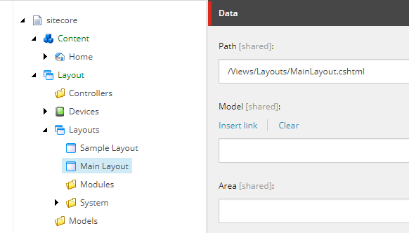
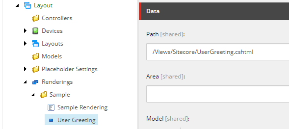
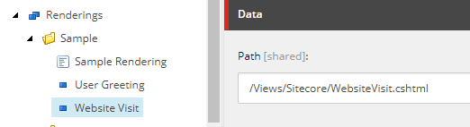
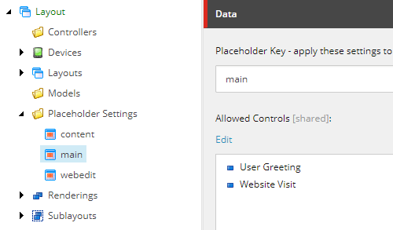
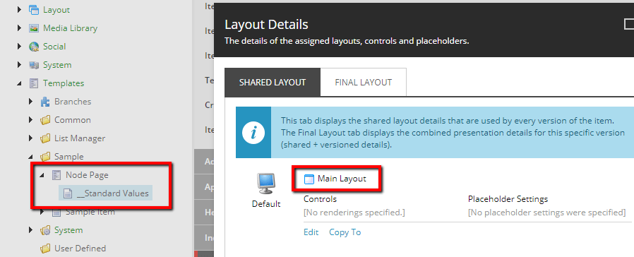
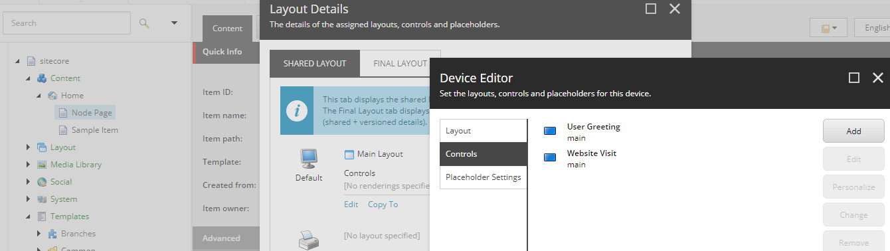
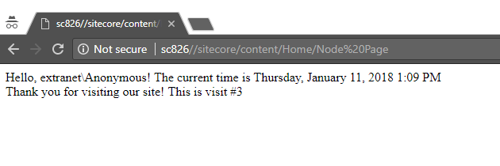
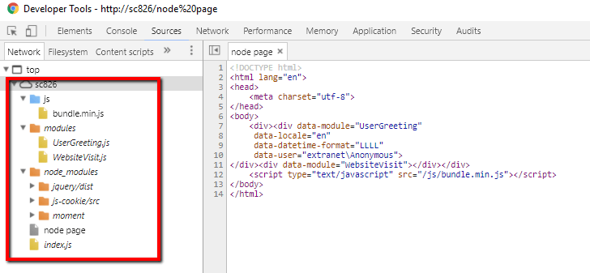

> **This post is part of a series**
> 1. **A quick-start guide to using Node to bundle JavaScript modules for Sitecore**
> 2. [A guide to automating Sitecore development tasks with Gulp](/automate-with-gulp/)

[[snippet]]
| This tutorial is aimed at Sitecore/.NET developers who are new to JavaScript compilation. We will build Sitecore renderings that use JavaScript modules, and learn how to bundle those modules with [rollup](https://rollupjs.org/).

## Why rollup?
Rollup is a module bundler that resolves dependencies between modules by using the [ES6 module export](http://exploringjs.com/es6/ch_modules.html) syntax from the latest JavaScript spec. You may have heard of `amd`, `cmd`, and `umd` - these are all specifications for how modules in JavaScript should be defined. They're great, but I like the idea of working with the syntax that's been approved into the language.
Additionally, I love that rollup uses `tree shaking`, which is the process of removing unused code from our final bundle. Tree shaking is helpful when using 3rd party libraries that offer many more functions than we actual use.

## Let's code!

### Prerequisites
Install node and npm globally on your system using the official installer - https://nodejs.org/en/download/
You can check if your system already has node and npm installed by running `$ node -v` and `$ npm -v`

Optional) Install [Visual Studio Code](https://code.visualstudio.com/). This is an awesome, lightweight, FREE code editor that works in both, Windows and Mac OS. It has intelliSence, debugging, and built-in git integration.

> **Note**
> If you don't feel like following along in the creation of files, the file structure created in this demo can be cloned from `https://github.com/anastasiya29/sitecore-node-demo`

### Set up Sitecore
* Install a vanilla instance of Sitecore (I'm using verion 8.2 update 6 right now, but the specific version doesn't really matter for this demo)
* Create an MVC Layout with a single placeholder called `main`

* Create two new View Renderings called `User Greeting` and `Website Visit`
 
* Create a placeholder settings item that permits our View Renderings to be inserted into the `main` placeholder

* Create a new template called `Node Page` which uses the custom MVC Layout

* Insert an instance of `Node Page` into the content tree under `Home`
* Use Experience Editor or Presentation Details to insert the two custom renderings into the page's `main` placeholder


Contents of `MainLayout.cshtml`
``` html
<!DOCTYPE html>
<html lang="en">
<head>
    <meta charset="utf-8">
</head>
<body>
    <div>@Html.Sitecore().Placeholder("main")</div>
    <script type="text/javascript" src="/js/bundle.min.js"></script>
</body>
</html>
```

Contents of `UserGreeting.cshtml`
``` html
<div data-module="UserGreeting"
     data-locale="@Sitecore.Context.Language.Name"
     data-datetime-format="LLLL"  @* In a real project, this value should come from custom site settings *@
     data-user="@Sitecore.Context.User.Identity.Name">
</div>
```

Contents of `WebsiteVisit.cshtml`
``` html
<div data-module="WebsiteVisit"></div>
```

### Set up npm project
Select a filesystem location outside of the /Website folder to serve as the root of our node project. For this demo, I made a "src" folder as a sibling to my "Website" folder. (From now on, when I say "root level" I am referring to this directory) Initialize a new npm repository inside this directory by running
``` bash
$ npm init
```

This step will ask you to name your npm project and define an entry point file. I stuck with the default `index.js`, but the name is up to you. A new file `package.json` is automatically created, which houses your custom configuration.

If using Visual Studio Code, use `Open Folder` to open it to your npm project root. You can create all your new files from this interface.

Create the `index.js` file at root level.

### Set up rollup
Use npm to add rollup to your local project
``` bash
$ npm install --save-dev rollup 
$ npm install --save-dev rollup-plugin-node-resolve
$ npm install --save-dev rollup-plugin-commonjs
$ npm install --save-dev rollup-plugin-inject
```

Using the `--save-dev` flag specified that this is compile-time dependency, and that we do not intend to use rollup in production. Note that the 3 plugins that we added are used for resolving dependencies of 3rd party libraries from our `node_modules` folder. These plugins are necessary because not all 3rd party libraries are written in ES6 syntax, and this handles the conversion for us. The "inject" plugin is for convenience - with it we don't need to explicitly "import" any global libraries like jQuery; they are imported automatically if our code uses them.

If you peek at your `package.json` right now, you'll see that new lines have been added for the rollup dependencies. This is how npm keeps track of what you have installed. If you peek inside you `node_modules` folder, you will see that you have dozens of modules in here now. That's because the modules you installed have their own dependencies, and this is all managed for us automagically by npm. If your node modules ever get screwed up, you can freely delete the entire `node_modules` folder and run `$ npm install`, which will cause npm to re-install everything as it is defined in `package.json`.

Create a `rollup.config.js` file at root level with the following content
``` javascript
export default {
    input: 'index.js',                    // This is our entry file
    output: {                             //
        file: 'Website/js/bundle.min.js', // This is where our bundle will be generated
        format: 'iife',                   // This is the format that denotes we are compiling for browsers
        sourcemap: 'inline'               // Source maps are for in-browser debugging, they map code in the bundle to the original files
    }
};
```

Your file structure should look like this:

``` text
Data/
Website/
├── Views/
│   └── Layouts/
│      └── MainLayout.cshtml
│   └── Sitecore/
│      ├── UserGreeting.cshtml
│      └── WebsiteVisit.cshtml
src/
├── index.js
├──node_modules/
├──package.json
└──rollup.config.js
```

Test that everything is configured correctly by running
``` bash
$ ./node_modules/.bin/rollup -c
```
This should generate a "Website/js/bundle.min.js" file

### Set up external dependencies
Lets add a few external libraries to make our example more interesting.
``` bash
$ npm install jquery
$ npm install moment
$ npm install js-cookie
```

We need to let rollup know about our external dependencies, so update `rollup.config.js` to look like this
``` javascript
import resolve from 'rollup-plugin-node-resolve';
import commonjs from 'rollup-plugin-commonjs';
import inject from 'rollup-plugin-inject';

export default {
    input: 'index.js',
    output: {
        file: 'Website/js/bundle.min.js',
        format: 'iife',
        sourcemap: 'inline'
    },
    plugins: [
        resolve({
            customResolveOptions: {
                module: true,
                moduleDirectory: 'node_modules',
                browser: true,
                jsnext: true
            }
        }),
        commonjs({
            include: 'node_modules/**',
        }),
        inject({
            include: '**/*.js',
            exclude: 'node_modules/**',
            $: 'jquery',
            Cookies: 'js-cookie',
            moment: 'moment'
        })
    ]
};
```

### Set up our custom JavaSript modules
Now we are ready to write the modules that will be used by our View Renderings. Create a "modules" folder at root level and add these 2 files to it.

`UserGreeting.js` - This modules takes parameters passed in from the Sitecore View and uses them to print a message about the current user and datetime.
``` javascript
export default class UserGreeting {
    constructor(domElement, { locale, user, datetimeFormat }) {
        this.render(domElement, locale, user, datetimeFormat);
    }

    render(domElement, locale, user, format) {
        const mom = moment();
        mom.locale(locale);

        const content = `Hello, ${user}! The current time is ${mom.format(format)}`;
        domElement.innerHTML = content;
    }
}
```

`WebsiteVisit.js` - This module uses a cookie to keep track of how many times the current user has visited the site.
``` javascript
const key = "websitevisit";

export default class WebsiteVisit {
    constructor(domElement) {
        const visits = parseInt(Cookies.get(key) || 0, 10) + 1;
        this.render(domElement, visits);
        Cookies.set(key, visits);
    }

    render(domElement, visits) {
        domElement.innerHTML = `Thank you for visiting our site! This is visit #${visits}`;
    }
}
```

Your file structure should now look like this:

``` text
Data/
Website/
├── js/
│   └── bundle.min.js
├── Views/
│   └── Layouts/
│      └── MainLayout.cshtml
│   └── Sitecore/
│      ├── UserGreeting.cshtml
│      └── WebsiteVisit.cshtml
src/
├── index.js
├── modules/
│   ├── UserGreeting.js
│   └── WebsiteVisit.js
├──node_modules/
│   ├── jquery
│   ├── moment
│   └── rollup
├──package.json
└──rollup.config.js
```

Finally, update the entry file `index.js` to import our modules and map them to the Sitecore Views.
``` javascript
import UserGreeting from './modules/UserGreeting.js';
import WebsiteVisit from './modules/WebsiteVisit.js';

const modules = {
    UserGreeting: UserGreeting,
    WebsiteVisit: WebsiteVisit
};

$("[data-module]").each(function () {
    const $moduleElement = $(this),
        data = $moduleElement.data(),
        moduleName = data.module;

    if (typeof modules[moduleName] === 'function') {
        var module = new modules[moduleName](this, data);
    }
});
```
> **Note**
> It's best practice to keep business logic out of the entry-point file; this file should be used to pull in the different modules used by your project.

### Wrap Up
Compile rollup again...
``` bash
$ ./node_modules/.bin/rollup -c
```
...and checkout the `bundle.min.js` that was produced. It contains our external dependencies and our custom modules, so the Sitecore Layout file only needs to reference this single file. Having a single file is great because you can minify it and serve the whole thing through a CDN to get really optimized page load times. (And yes, rollup has a minification plugin, but we're not covering that in this demo).

Publish the "Node Page" from earlier and open it in frontend mode.


Go to "inspect element" and checkout the list of JavaScript files loaded on the page. It's a small handful of files, just our custom stuff and the external libraries that we used. Compare that to the dozens of modules in your `node_modules` folder. None of that server-side bulk is carried over to the front-end bundle. That's pretty cool!


## Up Next
In the next post I will add a task manager to our stack to automate tasks like minimizing for production and pushing code changes into the local Sitecore instance.

Bon Appétit!

## Additional Resources
* Additional configuration options for rollup are explained [here](https://rollupjs.org/#using-config-files)
* If you want to try out other module loaders/bundler to see which one you like best, comparable alternatives to rollup are
  * [browserify](http://browserify.org/)
  * [steal](https://stealjs.com/docs/StealJS.quick-start.html)
  * [system](https://github.com/systemjs/systemjs)
(You've probably heard of [webpack](https://webpack.js.org/) too - webpack can certainly handle bundling, and much much more. It requires more configuration, so it's overkill for simple bundling.)
