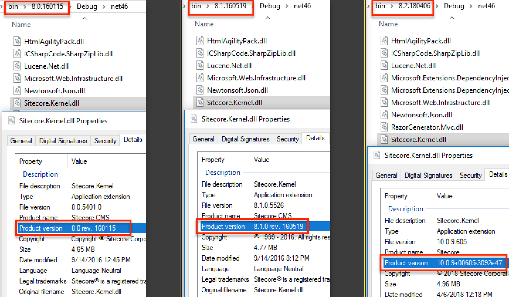

[[snippet]]
| One of the most important factors in authoring a successful Sitecore Marketplace module is maintaining compatibility with new Sitecore versions. This post goes over how to utilize .NET Core's simplified csproj footprint and implicit package dependency resolution to build your project against multiple Sitecore versions in one step. Automate the dev-ops part of maintaining modules so you can just have fun and focus on the code.

[.NET Core](https://github.com/dotnet/core) is the shiny new (open source!) framework from Microsoft. 

## New in .NET Core
When you create a new .NET Core project...


The first cool thing you notice is that you no longer have to unload the project to edit the csproj file. You can make changes in this file and your project will be updated immediately.


The second and third, even cooler things you notice is how tiny the csproj file is and the fact that you can target multiple .NET frameworks using the new `TargetFrameworks` property (it used to be just `TargetFramework` without the 's'). This is the entire file!
```xml
<Project Sdk="Microsoft.NET.Sdk">
  <PropertyGroup>
    <TargetFrameworks>net452;net46;</TargetFrameworks>
  </PropertyGroup>
</Project>
```

## Implicit package references
To get your solution ready to work with Sitecore, all you need to do is specify the appropriate target framework and pull in the Sitecore NuGet packages. This is the simplest setup (this pulls in all Sitecore NuGet packages)...
```xml
<Project Sdk="Microsoft.NET.Sdk">
  <PropertyGroup>
    <TargetFrameworks>net46;</TargetFrameworks>
    <SitecoreVersion>8.2.180406</SitecoreVersion>
  </PropertyGroup>

  <ItemGroup>
    <PackageReference Include="Sitecore" Version="$(SitecoreVersion)" />
  </ItemGroup>
</Project>
```

Or something like this is you want to be more picky about which Sitecore dlls to include...
```xml
<Project Sdk="Microsoft.NET.Sdk">

  <PropertyGroup>
    <TargetFrameworks>net46;</TargetFrameworks>
    <SitecoreVersion>8.2.180406</SitecoreVersion>
  </PropertyGroup>

  <ItemGroup>
    <PackageReference Include="Sitecore.Kernel" Version="$(SitecoreVersion)" />
    <PackageReference Include="Sitecore.Mvc" Version="$(SitecoreVersion)" />
    <PackageReference Include="Sitecore.Web" Version="$(SitecoreVersion)" />
  </ItemGroup>

</Project>
```

Notice that adding a NuGet reference did not create a package.json file in the project root, nor did it add references to a "packages" folder in the csproj file. The packages just auto-magically resolve when you build the solution. This simplified management of NuGet dependencies is what we'll leverage to plug in different Sitecore versions at build-time.

## Build against different Sitecore versions
.NET Core can target multiple .NET frameworks, but it cannot target multiple versions of a NuGet package. But by compartmentalizing the Sitcore NuGet package version into a variable, we can easily swap this value out through command line.

I added a powershell file in the project root with this content. This builds the solution 3 times using 3 different Sitecore versions.
```bat
dotnet build /p:SitecoreVersion=8.0.160115
dotnet build /p:SitecoreVersion=8.1.160519
dotnet build /p:SitecoreVersion=8.2.180406
```

All 3 Sitecore versions that I'm building here are compatible with .NET 4.6, so it's not necessary to include the `TargetFrameworks` property. But you certainly have that option:
```xml
dotnet build /p:TargetFrameworks=net452 /p:SitecoreVersion=8.0.160115
dotnet build /p:TargetFrameworks=net46 /p:SitecoreVersion=8.1.160519
dotnet build /p:TargetFrameworks=net461 /p:SitecoreVersion=8.2.180406
```

To ensure that the output for each Sitecore version goes into a distinct directory, I added a `BaseOutputPath` property to the csproj file.
```xml
<Project Sdk="Microsoft.NET.Sdk">
  <PropertyGroup>
    <TargetFrameworks>net46;</TargetFrameworks>
    <SitecoreVersion>8.2.180406</SitecoreVersion>
    <BaseOutputPath>bin\$(SitecoreVersion)</BaseOutputPath>
  </PropertyGroup>

  <ItemGroup>
    <PackageReference Include="Sitecore.Kernel" Version="$(SitecoreVersion)" />
    <PackageReference Include="Sitecore.Mvc" Version="$(SitecoreVersion)" />
    <PackageReference Include="Sitecore.Web" Version="$(SitecoreVersion)" />
  </ItemGroup>
</Project>
```

We can verify that this file causes the project to build 3 times, and the output goes into 3 separate directories


We can inspect the 3 output directories to verify that all NuGet packages were resolved implicitly and different versions of Sitecore assemblies were used in each build.


Voilà! Now that you have one-step compilation against different Sitecore versions, you can use TDS or gulp to copy the output into appropriate Sitecore instances for testing. Add in unit tests and you'll be even closer to a fully automated multi-version build.

Bon Appétit!