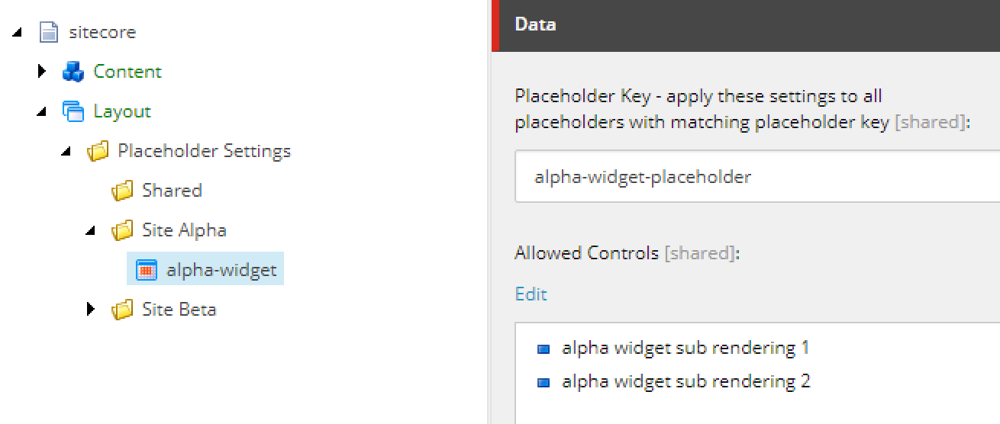
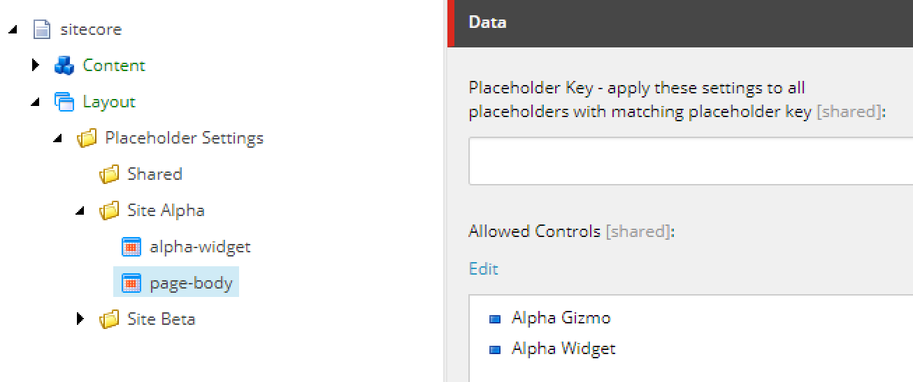
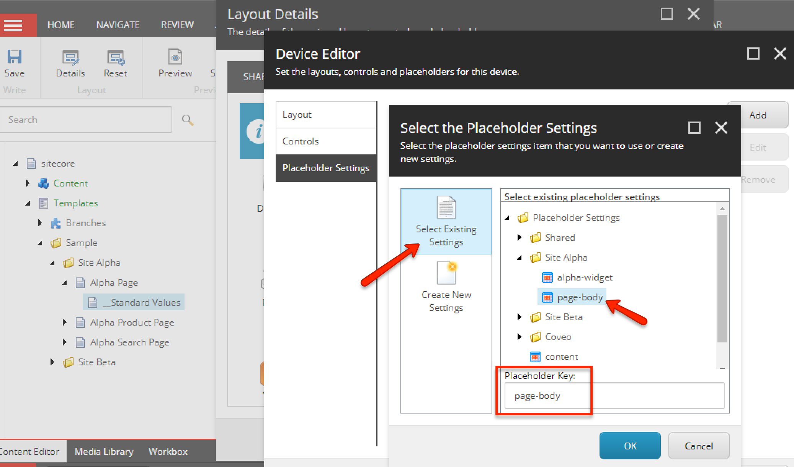
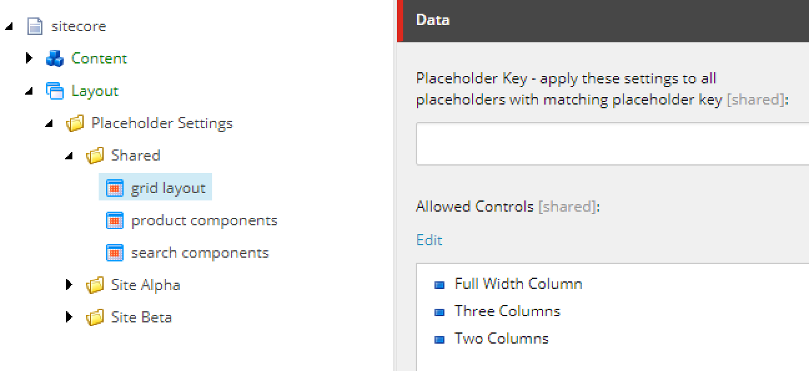
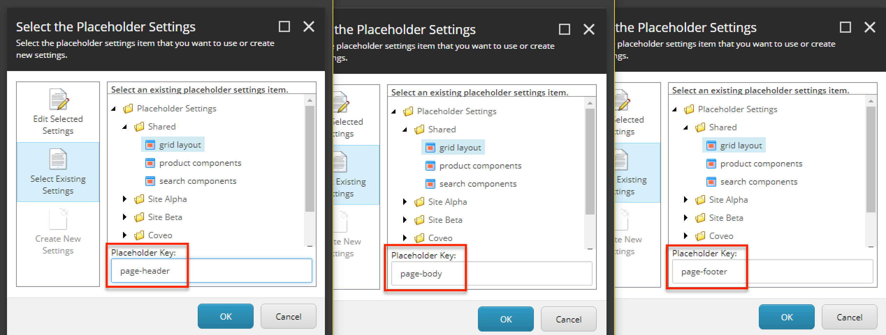
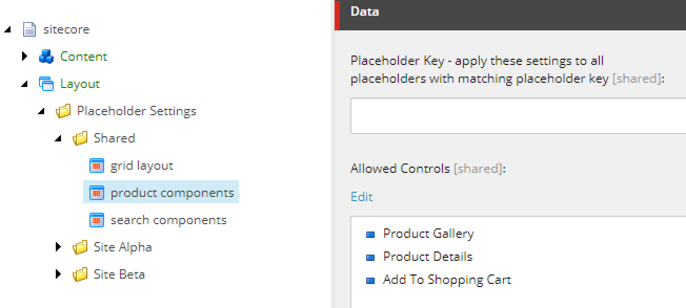
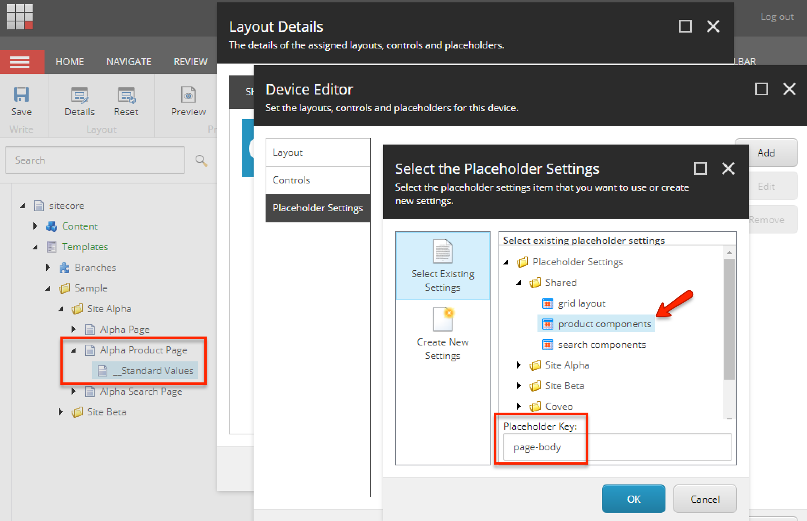

[[snippet]]
| > **This post is part of a series**
| > 1. **Structuring placeholder keys and settings in a multi-site Sitecore implementation using out-of-the-box functionality**
| > 2. [Custom pipeline processor to allow dynamically binding multiple placeholder settings items to a single placeholder key](/Sitecore/custom-getplaceholderrenderings-processor/)
| 
| A multi-site Sitecore implementation is when multiple different websites are deployed into the same Sitecore instance. Each site has its own unique set of renderings and templates. However, even sites that look and function completely different may still share a common set of generic renderings, like grid structures or an image carousel.
| 
| This makes management of placeholder keys and placeholder settings items tricky. We want to reuse the same renderings across multiple sites and page types, but the rules about what can be inserted where vary for different sites. This post goes over how to solve this challenge with a commonly forgotten out-of-the-box Sitecore feature called "Placeholder Overrides".

## Solution structure
A multi-site Sitecore instance usually looks something like this:
``` text
sitecore
   ├── Content
   │   ├──  Site Alpha (website root)
   │   └──  Site Beta  (website root)
   │
   ├── Layout
   │   ├──  Placeholder Settings
   │   │
   │   └──  Renderings
   │      ├── Shared
   │      │   ├── Two Columns
   │      │   ├── Three Columns
   │      │   ├── Full Width Column
   │      │   └── Sticky Sidebar
   │      │
   │      ├── Site Alpha
   │      │   ├── Alpha Widget
   │      │   └── Alpha Gizmo
   │      │
   │      └── Site Beta
   │          ├── Beta Widget
   │          └── Beta Gizmo
   │
   └── Templates
       ├──  Site Alpha
       │    └── Alpha Page
       │
       └──  Site Beta
            └── Beta Page
```

## Placeholders in site-specific renderings
Using the above Sitecore structure as an example, `Alpha Widget` is a rendering unique to `Site Alpha` and it will not be reused elsewhere. If the `Alpha Widget` exposes one placeholder called `alpha-widget-placeholder` then it makes sense to create a placeholder settings item with key value `alpha-widget-placeholder`.


This type or placeholder settings definition is `global` because it binds this particular set of renderings to all instances of `alpha-widget-placeholder` placeholders, and additioanl settings items using the same placeholder key are not allowed. This is the most commonly used approach.

## Placeholders in shared multi-site renderings
The presence of the `Placeholder Key` field on placeholder settings items encourages developers to think that placeholder keys and placeholder settings items should have a 1-to-1 relationship. So if your rendering exposes 3 placeholders, then you need to create 3 placeholder settings items. But there's another way to approach it.

### How to use placeholder overrides
1. Create a placeholder settings item, but make sure the `Placeholder Key` field is blank. Without a global key, this becomes a `Dynamic Placeholder`, which can be assigned to *any* key,


2. Open `Presentation Details` on a page template standard values. Select the option to add a new placeholder.
3. Using this dialog, attach the placeholder settings item from step 1 to a specific key.


The best part is that *multiple placeholder settings items can be assigned to the same key*. This opens up some interesting strategies.

### Strategy 1 - multiple placeholder keys, single set of shared renderings
Lets consider the set of shared renderings defined above - `Full Width Column`, `Two Column`, `Three Column`.

These renderings should be insertable almost anywhere. Under the standard approach (using placeholder settings with global keys), every time a new shared rendering is created, it needs to be manually added to multiple placeholder settings items. There's a better way.

We can group these renderings in one dynamic placeholder settings item...


... and then attach it to multiple placeholder keys.


Defining a single dynamic placeholder settings items for all your shared renderings centralizes control and allows you to enable new renderings on all pages in seconds. When a new rendering is created, simply add it to the dynamic placeholder settings item. That's it. All the places configured to use the dynamic settings item automatically gain access to the new rendering.

### Strategy 2 - one placeholder key, different renderings depending on site
Lets take one of our multi-site shared components as an example - `Full Width Column`
```html
<div class="full-width">
    @Html.Sitecore().Placeholder("full-width-content")
</div>
```

Using the placeholder overrides strategy, we can create one placeholder settings item with `Site Alpha` components and attach it to the `full-width-content` key of the `Site Alpha Page` template. Then create a second placeholder settings item with `Site Beta` components and attach it to the `full-width-content` key of the `Site Beta Page` template. Ta-da! Now the same key accepts different renderings depending on the site context.

The same strategy for sharing placeholders can be applied to layouts, allowing multiple sites to share one layout. Using this layout file as an example, we could allow different sites to insert different renderings into the `page-body` placeholder. We just need separate dynamic placeholder settings items.
```html
<!DOCTYPE html>
<html lang="en" xmlns="http://www.w3.org/1999/xhtml">
    <head>
        <title>@Html.Sitecore().Field("title", new { DisableWebEdit = true })</title>
        @Html.Sitecore().VisitorIdentification()
        @Html.Sitecore().Placeholder("page-head-resources")
    </head>
    <body>
        @Html.Sitecore().Placeholder("page-header")
        @Html.Sitecore().Placeholder("page-body")
        @Html.Sitecore().Placeholder("page-footer")

        @Html.Sitecore().Placeholder("page-scripts")
    </body>
</html>
```

### Strategy 3 - one placeholder key, different renderings depending on page type
This approach is similar to Strategy 2, but this time we're grouping renderings from the same feature set into a dynamic placeholder settings item.



This is useful when you have similar page types in multiple sites, like a Product Page or a Search Page, as you can manage the renderings available on a page type in a centralized way.

## Up Next
You may have noticed a limitation about Strategies 2 and 3 that narrow flexibility. In both cases, a single page template allows one placeholder settings item to be dynamically bound to one placeholder key. That's what we have to work with in out-of-the-box Sitecore. When you're editing a page in Experience Editor and you select some placeholder, the `GetAllowedRenderings` pipeline processor tries to find placeholder settings items for the selected placeholder, and it short circuits after finding the first match. Fortunately, it's a really simple customization to change this processor to return *multiple* placeholder settings items bound to the same placeholder key. This grants you the ultimate flexibility is sharing placeholders between sites.

Bon Appétit!