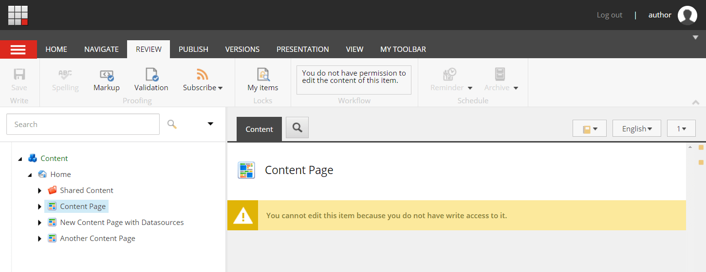
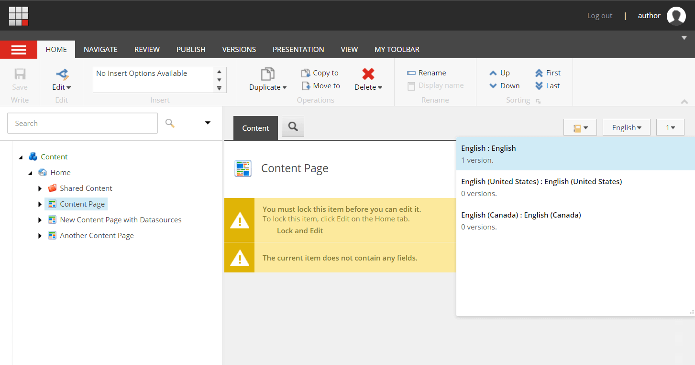
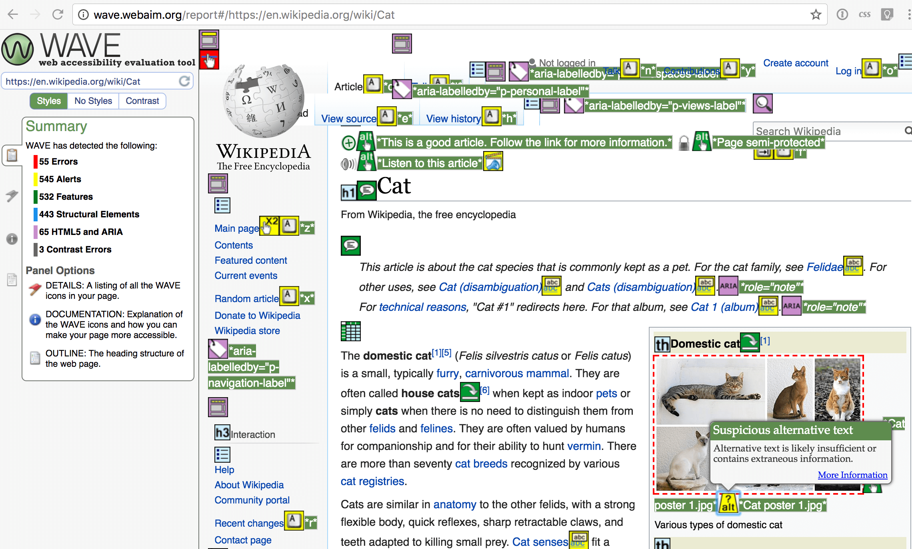

[[snippet]]
| ## 4 practices specific to testing Sitecore that all Quality Assurance Specialists should follow to ensure correctness and head off bugs early.

### Don't test Content Editor or Experience Editor using an admin account
When a new instance of Sitecore is set up, by default there is only one "admin" account. Creating additional users and roles may be held off until later in the project, but developing and testing using only the "admin" account may conceal bugs. Admins have access to items and fields that normal Content Authors do not. Authors may be restricted to specific languages, but Admins are not restricted. Authors have to lock pages for editing, but Admins bypass locks and workflow. Authors have different publishing access than admins. There are enough differences in the authoring experiences to merit testing using both types of accounts.

### Test custom functionality using at least 2 different languages
When a new instance of Sitecore is set up, by default there is only one language available, "en". Typically, developers build and test components using only "en", and additional languages are added only when they are needed by content entry folks. Developing in only the default language can hide bugs. The issue is that when items and fields are fetched from the database, a developer can explicitly specify which language version to fetch, or he can leave it up to Sitecore to use the current context language. When rendering a page on the front end, Sitecore sets the context language equal to the language of the page being viewed, so in the ideal scenario all the items and fields that we fetch in code are in the same language as our page. However, sometimes Sitecore doesn't have a page language to go by, like during an index crawl. In this case, Sitecore defaults to "en" as the context language. So if you are crawling the French version of a page, and the code fetches data from the database without explicitly specifying a language, you may get "en" content indexed in your French page.

### Test that renderings fail gracefully if missing datasources
Not all renderings use datasources, but those that do need to be coded to account for the possibility that the datasource might be missing. How can a datasource be missing:
- The rendering was added through Presentation Details, which doesn't prompt for the creation of a datasource item, and the user forgot to add it
- The datasource item was deleted by accident
- The datasource item exists, but it was not copied to web database because it has validation errors or it's not in approved workflow state
If the datasource is missing, the ideal behavior is to show a useful error message in editing mode, and to suppress the rendering entirely in front-end mode. We certainly need to avoid a single rendering taking down an entire page. To test graceful failure, use Experience Editor to add a rendering with datasource to a page, save, and then delete the datasource item from the Sitecore tree in Content Editor. Check the page in editing, preview, and front-end modes.

### Run accessibility compliance scans early and often
In scans like SEO and performance, different elements contribute to a single page-level score, so it makes sense to hold off running these tests until the end of a project, when development is nearly complete and pages are near their final state. However, accessibility compliance errors are assigned at the level of individual DOM elements, so it's ok to run an accessibility scan even when a page is only partially complete.
In my experience, remediation of accessibility compliance errors can be pretty involved. For example, if the HTML of a component needs to be changed, then CSS and JavaScript may need to be refactored too. So it's a good idea to start scans early in the project.

Tool to use: https://wave.webaim.org/

