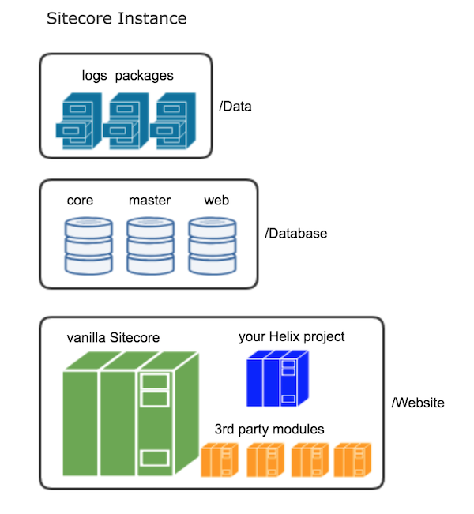

[[snippet]]
| > **This post is part of a series**
| > 1. **Project Organization - Beyond Helix**
| > 2. ["Sitecore Flow" - The benefits of versioning your Sitecore environments](/Sitecore/DevOps/version-control-sitecore/)
| 
| This post covers recommendations on how to structure your Sitecore solution to support synchronized environments and quick spin-up of new instances.

## Acknowledgement
This post is based on the 2017 Sitecore Symposium presentation by Chris Nielsen titled "A Day in the Life of a Sitecore Developer".

## What's covered by Helix
Helix has been well socialized into the Sitecore community, so here is just a minimal summary.
`Foundation` - the layer containing common code that's shared by multiple components. For example - custom Sitecore pipelines, base templates, or extension methods for Sitecore.Data.Item.
`Feature` (depends on Foundation) - the layer containing independent and modular building blocks that define the user experience on the site. For example - Navigation, Search, Image Gallery.
`Project` (depends on Foundation and Feature) - the layer that ties all the features together with a unique look-and-feel. For example - layouts, structural components, front-end assets.

## What's missing in Helix
In a vanilla .NET web application, it's normal to deploy the solution into an empty folder since the solution IS the website. But in the Sitecore world, what we build and deploy into the Sitecore /Website root is just a tiny part of the whole application. Helix is a way to organize that tiny part that you and your team are responsible for.

In this diagram, the 3rd party modules are things like:
* `Sitecore Support` patches
* Installed tools like `Sitecore Powershell Extensions` and `Razl`
* `Sitecore Marketplace` modules

As Chris said, "Anything that isn't your code, anything that your team is not specifically responsible for maintaining, does not belong in your repository at all. If it's not in your repository, it can't be part of Helix."

## How to manage the 3rd party modules
It's clear that 3rd party modules should not be part of your Helix solution source code, so what repo should they go into? You might be thinking, "Why do they need to go into a repo at all?" The reason is that 3rd party modules are not a case of "deploy once and forget". They need to be managed and upgraded; they have independent release cycles. A typical Sitecore projects leverages at least 8 instances (Dev CM/CD, QA CM/CD1/CD2, PROD CM/CD1/CD2), and that's not even counting instances on developer machines. No one wants to install packages manually 8 times, while risking developer machines being out of sync from PROD. 

The only way to keep all environments in sync is to centrally manage the modules and automate their deployment. This means they must be source controlled.

Our teams have had great success in using a separate solution for managing these modules - one that we call `Bedrock`. `Bedrock` is maintained in a separate repository; it contains:
* all the packages and files necessary to deploy the modules
* configuration that controls which packages belong in which server role (CM, CD, or both)
* powershell scripts for Octopus to actually get these things installed

Our CI/CD tools have separate build and release definitions for Bedrock and the Helix project, so either one can be upgraded independently.

## Key benefits
Key benefits of storing 3rd party modules outside of the Helix solution:
* Minimize the deployment time of the Helix solution
* Independent release cycles
* All Sitecore instances across all environments (including developer machines) remain in sync

## Up Next
In the next post will be automate the management of this Sitecore -> Bedrock -> Helix model by using git in a new way.

Bon Appétit!