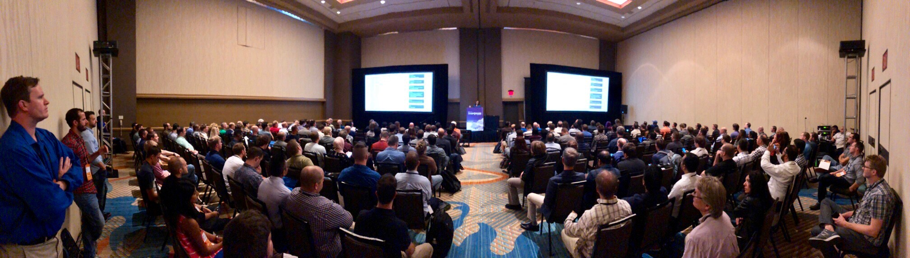

## Take your Sitecore project to the next level with Node.js

[[snippet]]
| Thank you so much to the 200+ people who attended my session - I'm thrilled that so many people got something out of it. Feedback/questions are always welcome, you can contact me on Twitter @AnastasiyaFlynn.

### Session description
Many Sitecore developers still see JavaScript as just a client-side language that’s used to enhance the UI. This session proves that JavaScript belongs server-side as well, showing how to use popular Node.js-powered frameworks to automate server-side processes and make our lives as developers easier. The applications of server-side JavaScript covered in this session do not depend on JSS, and can be used in traditional Sitecore MVC projects.

### Session takeaways
This presentation demonstrates practical applications of server-side JavaScript at 3 stages of a Sitecore project lifecycle.
1. Setup: How to automate the generation of new Sitecore solutions with *yeoman*
2. Development: How to build a modular TypeScript library against a headless CMS with *webpack*
3. Testing: How to enforce Helix design principles with unit tests written in *Jasmine* and run with *Karma*

> Slides, session recording, and links to additional resources available on [Noti.st](https://noti.st/anastasiyaflynn/H10Slq/take-your-sitecore-project-to-the-next-level-with-node-js)

Bon Appétit!